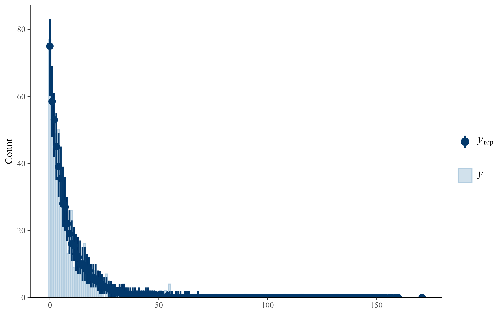

# Aim

This page evaluates the random-effect structure used in the Bayesian phylogenetic models.

The primary goal is to determine whether study identity should be retained in addition to population identity. Because multiple observations may originate from the same population and some populations may be represented in multiple studies, these grouping factors can partially overlap.

To assess the importance of study identity, we first quantify the overlap between populations and studies and then compare two alternative random-effect structures:

1.  Population identity only.
2.  Population identity plus study identity.

Both models additionally account for species-level variation and phylogenetic relatedness among species.

# Load packages and data

```{r}
#| label: setup
#| message: false
#| warning: false

library(brms)
library(loo)
library(knitr)
library(tidyverse)

dat_model_phylo <- readRDS("data/processed/dat_model_phylo.rds")
phylo_mat <- readRDS("data/processed/phylo_mat.rds")
```

# Prepare model dataset

```{r}
#| label: prepare-data

dat_basic_phylo <- dat_model_phylo

dat_basic_phylo$nest_box <- as.factor(dat_basic_phylo$nest_box)
dat_basic_phylo$marker_type <- as.factor(dat_basic_phylo$marker_type)
dat_basic_phylo$id <- as.factor(dat_basic_phylo$id)
dat_basic_phylo$population_id <- as.factor(dat_basic_phylo$population_id)
dat_basic_phylo$species_nonphylo <- as.factor(dat_basic_phylo$species_nonphylo)
dat_basic_phylo$species_phylo <- as.factor(dat_basic_phylo$species_phylo)

dat_basic_phylo <- dat_basic_phylo[
  !is.na(dat_basic_phylo$n_epp_broods) &
    !is.na(dat_basic_phylo$n_broods_sampled) &
    dat_basic_phylo$n_broods_sampled > 0 &
    dat_basic_phylo$n_epp_broods <= dat_basic_phylo$n_broods_sampled &
    !is.na(dat_basic_phylo$id) &
    !is.na(dat_basic_phylo$population_id) &
    !is.na(dat_basic_phylo$species_nonphylo) &
    !is.na(dat_basic_phylo$species_phylo),
]

dat_basic_phylo <- droplevels(dat_basic_phylo)
```

# Data summary

```{r}
#| label: data-checks

species_in_phylo <- all(
  dat_basic_phylo$species_phylo %in% rownames(phylo_mat)
)

data_checks <- data.frame(
  quantity = c(
    "Records",
    "Species",
    "Populations",
    "Studies",
    "Species present in phylogenetic matrix"
  ),
  value = c(
    nrow(dat_basic_phylo),
    length(unique(dat_basic_phylo$species_phylo)),
    length(unique(dat_basic_phylo$population_id)),
    length(unique(dat_basic_phylo$id)),
    species_in_phylo
  )
)

kable(data_checks)
```

# Overlap between populations and studies

To evaluate whether population identity already captures most of the repeated-measures structure in the dataset, we quantified how many studies contributed data to each population.

```{r}
#| label: study-population-overlap

study_population_overlap <- aggregate(
  id ~ population_id,
  data = dat_basic_phylo,
  FUN = function(x) length(unique(x))
)

names(study_population_overlap) <- c(
  "population_id",
  "n_studies"
)

overlap_table <- as.data.frame(
  table(study_population_overlap$n_studies)
)

names(overlap_table) <- c(
  "n_studies",
  "n_populations"
)

overlap_table$percent_populations <- round(
  100 * overlap_table$n_populations /
    sum(overlap_table$n_populations),
  1
)

kable(overlap_table)
```

This table indicates how frequently populations are represented by multiple studies. Strong overlap between population identity and study identity would suggest that population identity may already account for much of the non-independence among observations.

# Priors

The same prior specification was used for both candidate models.

```{r}
#| label: priors

priors_basic <- c(
  prior(normal(0, 2), class = "Intercept"),
  prior(exponential(1), class = "sd")
)
```

# Overall model: population identity only

This model accounts for repeated observations of the same population, species-level variation, and phylogenetic relatedness.

```{r}
#| label: fit-basic-pop
#| eval: false

m_basic_pop <- brm(
  n_epp_broods | trials(n_broods_sampled) ~
    1 +
    (1 | population_id) +
    (1 | species_nonphylo) +
    (1 | gr(species_phylo, cov = phylo_mat)),
  data = dat_basic_phylo,
  data2 = list(phylo_mat = phylo_mat),
  family = beta_binomial(link = "logit", link_phi = "log"),
  prior = priors_basic,
  chains = 4,
  cores = 4,
  iter = 10000,
  warmup = 5000,
  control = list(
    adapt_delta = 0.99,
    max_treedepth = 15
  ),
  seed = 123
)
```

```{r}
#| label: load-summary-basic-pop

m_basic_pop <- readRDS(
  "models/m_basic_pop.rds"
)

summary(m_basic_pop)
```

# Overall model: population identity plus study identity

This model additionally accounts for non-independence among observations originating from the same study.

```{r}
#| label: fit-basic-pop-study
#| eval: false

m_basic_pop_study <- brm(
  n_epp_broods | trials(n_broods_sampled) ~
    1 +
    (1 | id) +
    (1 | population_id) +
    (1 | species_nonphylo) +
    (1 | gr(species_phylo, cov = phylo_mat)),
  data = dat_basic_phylo,
  data2 = list(phylo_mat = phylo_mat),
  family = beta_binomial(link = "logit", link_phi = "log"),
  prior = priors_basic,
  chains = 4,
  cores = 4,
  iter = 10000,
  warmup = 5000,
  control = list(
    adapt_delta = 0.99,
    max_treedepth = 15
  ),
  seed = 124
)
```

```{r}
#| label: load-summary-basic-pop-study

m_basic_pop_study <- readRDS(
  "models/m_basic_pop_study.rds"
)

summary(m_basic_pop_study)
```

# Model comparison

Predictive performance was compared using leave-one-out cross-validation (LOO). The LOO comparison was computed in the external model-running script and saved as `models/loo_comparison_basic.rds`.

```{r}
#| label: loo-comparison

loo_comparison_basic <- readRDS(
  "models/loo_comparison_basic.rds"
)

loo_basic_df <- as.data.frame(
  loo_comparison_basic
)

loo_basic_df$model <- rownames(
  loo_basic_df
)

loo_basic_df <- loo_basic_df[
  ,
  c("model", "elpd_diff", "se_diff")
]

knitr::kable(
  loo_basic_df,
  digits = 2
)
```

# Sampling diagnostics

```{r}
#| label: sampling-diagnostics

m_basic_pop <- readRDS(
  "models/m_basic_pop.rds"
)

np_basic <- nuts_params(
  m_basic_pop
)

n_divergent <- sum(
  np_basic$Parameter == "divergent__" &
    np_basic$Value == 1
)

knitr::kable(
  data.frame(
    diagnostic = "Divergent transitions",
    value = n_divergent
  )
)
```

# Posterior predictive check

```{r}
#| label: posterior-predictive-check
#| fig-width: 8
#| fig-height: 5


```

# Decision

The comparison evaluates whether study identity contributes meaningful information beyond population identity. If the model including study identity shows little improvement in predictive performance and the overlap analysis indicates that most populations are represented by a single study, population identity alone provides an adequate representation of repeated-measures structure. The selected random-effect structure is retained in all subsequent environmental models.
