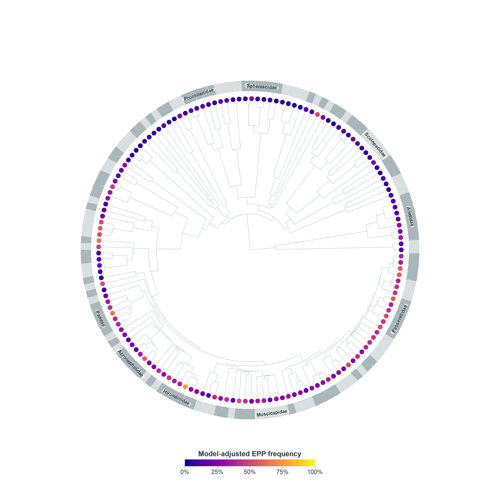

---
title: "Taxonomy and phylogeny"
---

## Overview

This chapter prepares the taxonomic and phylogenetic structure used in the Bayesian comparative analyses. Starting from the cleaned modelling dataset created in the data-preparation chapter, species names are linked to a Clements-matched avian phylogeny, the tree is pruned to the retained species, and a phylogenetic correlation matrix is generated for use in `brms`.

## Load packages and data

```{r}
#| label: setup
#| echo: true
#| code-fold: true
#| code-summary: "Show setup code"
#| message: false
#| warning: false

library(tidyverse)
library(ape)
library(knitr)

dat_model <- readRDS("data/processed/dat_model.rds")

# No order/family merge is performed here. The modelling workflow only requires
# Clements-matched species names for the phylogenetic tree.
tree <- ape::read.nexus("phylogeny/summary_dated_clements.nex")
```

## Phylogenetic tree overview

The phylogenetic analyses use a Clements-matched avian tree described by McTavish et al. (2025).

```{r}
#| label: tree-overview
#| echo: true
#| code-fold: true
#| code-summary: "Show setup code"
#| message: false
#| warning: false

tree
```

## Species included in the analytical dataset

The cleaned EPP dataset contains species names matched to the Clements taxonomic backbone. These names are stored in `Clements_name` and used to link records to the Clements-matched phylogenetic tree.

```{r}
#| label: species-summary
#| echo: true
#| code-fold: true
#| code-summary: "Show setup code"
#| message: false
#| warning: false

species_data <- dat_model %>%
  distinct(Clements_name) %>%
  filter(!is.na(Clements_name)) %>%
  pull(Clements_name)

species_tree <- tree$tip.label

species_summary <- tibble(
  metric = c(
    "Species in analytical dataset",
    "Tips in full phylogeny"
  ),
  value = c(
    length(species_data),
    length(species_tree)
  )
)

knitr::kable(species_summary)
```

## Check taxonomic matching

We verified that all species included in the analytical dataset were represented in the phylogenetic tree.

```{r}
#| label: species-names-check
#| echo: true
#| code-fold: true
#| code-summary: "Show setup code"
#| message: false
#| warning: false

missing_from_tree <- setdiff(
  species_data,
  species_tree
)

missing_from_tree

if (length(missing_from_tree) > 0) {
  stop("Some species in the analytical dataset are missing from the phylogenetic tree.")
}
```

```{r}
#| label: missing-summary
#| echo: true
#| code-fold: true
#| code-summary: "Show setup code"
#| message: false
#| warning: false

tibble(
  n_species_missing_from_tree = length(missing_from_tree)
) %>%
  knitr::kable()
```

A value of zero indicates complete taxonomic matching between the dataset and the phylogeny.

## Prune the phylogeny

The full phylogenetic tree contains many species not included in the EPP dataset. Therefore, the tree was pruned to retain only species present in the analytical dataset.

```{r}
#| label: prune-tree
#| echo: true
#| code-fold: true
#| code-summary: "Show setup code"
#| message: false
#| warning: false

tree_pruned <- ape::drop.tip(
  tree,
  setdiff(tree$tip.label, species_data)
)
```

```{r}
#| label: pruned-tree-overview
#| echo: true

tree_pruned
```

```{r}
#| label: pruned-tree-summary
#| echo: true
#| code-fold: true
#| code-summary: "Show setup code"
#| message: false
#| warning: false

tibble(
  metric = c(
    "Species retained in analytical dataset",
    "Tips in pruned phylogeny"
  ),
  value = c(
    length(species_data),
    length(tree_pruned$tip.label)
  )
) %>%
  knitr::kable()
```

## Model-adjusted EPP across the phylogeny

The pruned phylogeny was used to visualise model-adjusted species-level EPP
frequencies. These are partially pooled posterior estimates from the overall
beta-binomial model, not raw species proportions. The plotted estimate retains
the phylogenetic and non-phylogenetic species effects while fixing the
population random effect at zero.

```{r}
#| label: model-adjusted-epp-phylogeny-figure
#| echo: true
#| code-fold: true
#| code-summary: "Show setup code"
#| message: false
#| warning: false

#| fig-cap: "Model-adjusted EPP frequency across the avian phylogeny. Point colour shows the posterior mean species-level EPP frequency. The outer band denotes families, and names are printed directly on the band for families represented by at least five species."
#| fig-width: 9
#| fig-height: 9

if (file.exists("figures/model_adjusted_epp_phylogeny.png")) {
  
} else {
  cat("The model-adjusted phylogeny is not available yet. Run scripts/make_model_adjusted_epp_phylogeny.R.")
}
```

## Generate the phylogenetic correlation matrix

The Bayesian models account for phylogenetic non-independence among species through a phylogenetic random effect.

To implement this structure in `brms`, the pruned phylogeny was converted into a phylogenetic correlation matrix.

```{r}
#| label: phylogenetic-correlation-matrix
#| echo: true
#| code-fold: true
#| code-summary: "Show setup code"
#| message: false
#| warning: false

phylo_mat <- ape::vcv.phylo(
  tree_pruned,
  corr = TRUE
)

dim(phylo_mat)
```

```{r}
#| label: phylo-matrix-preview
#| echo: true

phylo_mat[1:5, 1:5]
```

## Prepare phylogenetic grouping variables

Two species-level grouping variables were retained for the Bayesian models:

- `species_phylo` - species identity linked to the phylogenetic covariance matrix;
- `species_nonphylo` - species identity modelled as an additional non-phylogenetic random effect.

Including both random effects allows the models to partition variation attributable to shared evolutionary history and species-specific variation not explained by phylogeny.

```{r}
#| label: add-phylo-columns
#| echo: true
#| code-fold: true
#| code-summary: "Show setup code"
#| message: false
#| warning: false

dat_model_phylo <- dat_model %>%
  mutate(
    species_phylo = Clements_name,
    species_nonphylo = Clements_name
  ) %>%
  filter(
    species_phylo %in% tree_pruned$tip.label
  )

dir.create("data/processed", recursive = TRUE, showWarnings = FALSE)
saveRDS(dat_model_phylo, "data/processed/dat_model_phylo.rds")
saveRDS(tree_pruned, "data/processed/tree_pruned.rds")
saveRDS(phylo_mat, "data/processed/phylo_mat.rds")
```

## Final dataset summary

```{r}
#| label: phylo-dataset-summary
#| echo: true
#| code-fold: true
#| code-summary: "Show setup code"
#| message: false
#| warning: false

dat_model_phylo %>%
  summarise(
    n_records = n(),
    n_references = n_distinct(id_reference),
    n_species_phylo = n_distinct(species_phylo),
    n_species_nonphylo = n_distinct(species_nonphylo),
    n_populations = n_distinct(population_id)
  ) %>%
  knitr::kable()
```

## Output files

| File | Description |
|------------------------------------|------------------------------------|
| `dat_model_phylo.rds` | Analytical dataset with phylogenetic grouping variables |
| `tree_pruned.rds` | Pruned phylogenetic tree containing only species included in the study |
| `phylo_mat.rds` | Phylogenetic correlation matrix used in Bayesian models |

