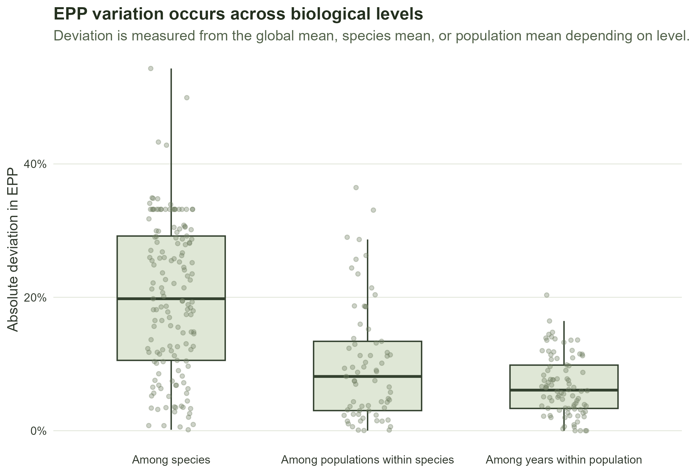
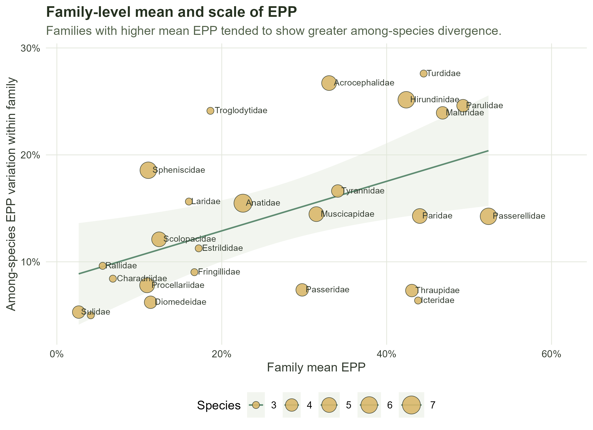

```{r}
#| label: setup
#| message: false
#| warning: false

library(dplyr)
library(knitr)
```

# Aim

This section asks where variation in extra-pair paternity (EPP) occurs in the dataset: among species, among populations of the same species, or among years within the same population.

# Load data

```{r}
#| label: load-data

dat_model_phylo <- readRDS("data/processed/dat_model_phylo.rds")
```

# Prepare data

```{r}
#| label: prepare-data

weighted_mean <- function(x, w) {
  keep <- !is.na(x) & !is.na(w) & w > 0
  sum(x[keep] * w[keep]) / sum(w[keep])
}

dat_var <- dat_model_phylo %>%
  filter(
    !is.na(n_epp_broods),
    !is.na(n_broods_sampled),
    n_broods_sampled > 0,
    n_epp_broods <= n_broods_sampled,
    !is.na(species_phylo),
    !is.na(population_id)
  ) %>%
  mutate(
    epp_rate = n_epp_broods / n_broods_sampled,
    year_of_study_start = as.numeric(year_of_study_start),
    year_of_study_end = as.numeric(year_of_study_end),
    study_year = ifelse(
      !is.na(year_of_study_end),
      rowMeans(
        cbind(year_of_study_start, year_of_study_end),
        na.rm = TRUE
      ),
      year_of_study_start
    )
  )
```

# Data support

```{r}
#| label: data-support

population_counts <- dat_var %>%
  group_by(species_phylo) %>%
  summarise(
    n_populations = n_distinct(population_id),
    .groups = "drop"
  )

repeated_population_counts <- dat_var %>%
  filter(!is.na(study_year)) %>%
  group_by(population_id) %>%
  summarise(
    n_records = n(),
    n_years = n_distinct(study_year),
    .groups = "drop"
  )

variation_data_support <- data.frame(
  quantity = c(
    "Records",
    "Species",
    "Populations",
    "Species with >=3 populations",
    "Populations with >=3 study years",
    "Records in populations with >=3 study years"
  ),
  value = c(
    nrow(dat_var),
    n_distinct(dat_var$species_phylo),
    n_distinct(dat_var$population_id),
    sum(population_counts$n_populations >= 3),
    sum(repeated_population_counts$n_years >= 3),
    sum(
      dat_var$population_id %in%
        repeated_population_counts$population_id[
          repeated_population_counts$n_years >= 3
        ]
    )
  )
)

kable(variation_data_support)
```

# Species, population and year-level summaries

```{r}
#| label: variation-summaries

species_epp <- dat_var %>%
  group_by(species_phylo) %>%
  summarise(
    species_mean_epp = weighted_mean(epp_rate, n_broods_sampled),
    n_records = n(),
    n_populations = n_distinct(population_id),
    total_broods = sum(n_broods_sampled, na.rm = TRUE),
    .groups = "drop"
  )

global_mean_epp <- weighted_mean(
  dat_var$epp_rate,
  dat_var$n_broods_sampled
)

population_epp <- dat_var %>%
  group_by(species_phylo, population_id) %>%
  summarise(
    population_mean_epp = weighted_mean(epp_rate, n_broods_sampled),
    n_records = n(),
    n_years = n_distinct(study_year[!is.na(study_year)]),
    total_broods = sum(n_broods_sampled, na.rm = TRUE),
    .groups = "drop"
  ) %>%
  left_join(
    species_epp %>%
      select(species_phylo, species_mean_epp, n_populations),
    by = "species_phylo"
  )

repeated_population_ids <- population_epp %>%
  filter(n_years >= 3) %>%
  pull(population_id)

year_epp <- dat_var %>%
  filter(population_id %in% repeated_population_ids) %>%
  left_join(
    population_epp %>%
      select(population_id, population_mean_epp),
    by = "population_id"
  ) %>%
  group_by(population_id) %>%
  summarise(
    abs_deviation = mean(
      abs(epp_rate - population_mean_epp),
      na.rm = TRUE
    ),
    .groups = "drop"
  )

variation_deviations <- bind_rows(
  species_epp %>%
    transmute(
      level = "Among species",
      unit = as.character(species_phylo),
      abs_deviation = abs(species_mean_epp - global_mean_epp)
    ),
  population_epp %>%
    filter(n_populations >= 3) %>%
    transmute(
      level = "Among populations within species",
      unit = as.character(population_id),
      abs_deviation = abs(population_mean_epp - species_mean_epp)
    ),
  year_epp %>%
    transmute(
      level = "Among years within population",
      unit = as.character(population_id),
      abs_deviation = abs_deviation
    )
)

variation_deviations$level <- factor(
  variation_deviations$level,
  levels = c(
    "Among species",
    "Among populations within species",
    "Among years within population"
  )
)

variation_scale_summary <- variation_deviations %>%
  group_by(level) %>%
  summarise(
    n_units = n(),
    median_abs_deviation = median(abs_deviation, na.rm = TRUE),
    mean_abs_deviation = mean(abs_deviation, na.rm = TRUE),
    upper_quartile_abs_deviation = quantile(abs_deviation, 0.75, na.rm = TRUE),
    .groups = "drop"
  )

kable(variation_scale_summary, digits = 3)
```

# Variation across biological levels

For the population-level component, only species represented by at least three populations are included. For the year-level component, only populations represented by at least three distinct study years are included. Each year-level point represents one population, summarised as the mean absolute yearly deviation from that population's mean EPP.

```{r}
#| label: variation-level-plot
#| fig-width: 8
#| fig-height: 5.5


```

# Family level divergence

Because most variation occurred among species, we also explored whether avian families differed in the extent of among-species divergence in EPP.

```{r}
#| label: family-level-divergence

if ("family" %in% names(dat_var) && any(!is.na(dat_var$family))) {
  species_family_epp <- dat_var %>%
    filter(
      !is.na(family),
      !is.na(species_phylo)
    ) %>%
    group_by(family, species_phylo) %>%
    summarise(
      species_mean_epp = weighted_mean(epp_rate, n_broods_sampled),
      total_broods = sum(n_broods_sampled, na.rm = TRUE),
      n_records = n(),
      .groups = "drop"
    )

  family_species_variation <- species_family_epp %>%
    group_by(family) %>%
    summarise(
      n_species = n_distinct(species_phylo),
      mean_species_epp = mean(species_mean_epp, na.rm = TRUE),
      sd_species_epp = sd(species_mean_epp, na.rm = TRUE),
      min_species_epp = min(species_mean_epp, na.rm = TRUE),
      max_species_epp = max(species_mean_epp, na.rm = TRUE),
      range_species_epp = max_species_epp - min_species_epp,
      .groups = "drop"
    ) %>%
    filter(n_species >= 3) %>%
    arrange(desc(sd_species_epp))

  family_mean_scale_correlation <- cor.test(
    family_species_variation$mean_species_epp,
    family_species_variation$sd_species_epp,
    method = "pearson"
  )

  family_mean_scale_model <- lm(
    sd_species_epp ~ mean_species_epp,
    data = family_species_variation
  )

  family_mean_scale_summary <- data.frame(
    statistic = c(
      "Pearson correlation",
      "Correlation p-value",
      "Linear-model R-squared"
    ),
    value = c(
      unname(family_mean_scale_correlation$estimate),
      family_mean_scale_correlation$p.value,
      summary(family_mean_scale_model)$r.squared
    )
  )

  kable(family_species_variation, digits = 3)
  kable(family_mean_scale_summary, digits = 3)
} else {
  cat(
    "Family-level divergence was not calculated because no family column is present in the current dataset.\n"
  )
}
```

```{r}
#| label: family-mean-scale-plot
#| fig-width: 8
#| fig-height: 5.8


```

Family-level mean EPP was positively associated with among-species variation in EPP (r = 0.55). However, mean EPP explained only approximately 30% of variation in family-level scale, suggesting that families differ in among-species divergence beyond differences in their average EPP level.
