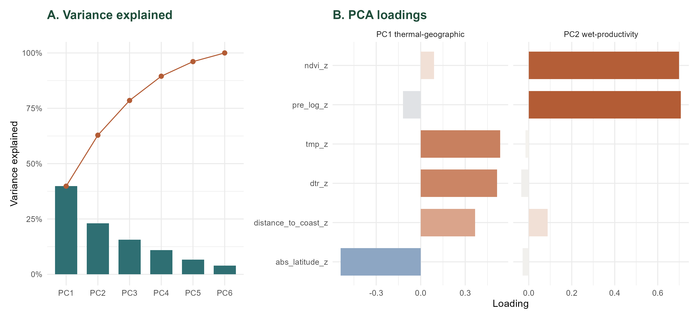

---
title: "PCA for environmental predictors"
---

## Overview

The environmental predictors combine climate, productivity, and geography. These variables describe related ecological gradients and should not be interpreted as fully independent axes of variation. We therefore use principal component analysis (PCA) to construct a small number of orthogonal predictors for the main environmental models.

The PCA is fitted to complete cases for the selected environmental-geographic variables.

```{r}
#| label: pca-setup
#| echo: true

library(dplyr)
library(readr)
library(tidyr)
library(tibble)
library(knitr)
library(ggplot2)

pca_model_set_dir <- "models/pca_environment_model_set"
pca_legacy_dir <- "models/pca_environment"

dat_model_phylo <- readRDS("data/processed/dat_model_phylo.rds")
```

## Input variables

```{r}
#| label: pca-input-variables-table
#| echo: true

tibble(
  `Data component` = c(
    "Mean temperature",
    "Precipitation",
    "Thermal variability",
    "Productivity",
    "Latitude",
    "Coast proximity"
  ),
  `Variable used in PCA` = c(
    "tmp_cru_C_first_month",
    "pre_cru_mm_first_month",
    "dtr_cru_C_first_month",
    "ndvi_first_month_median_30km",
    "abs_latitude",
    "distance_to_coast_km"
  ),
  Transformation = c(
    "scaled",
    "log1p, then scaled",
    "scaled",
    "scaled",
    "scaled",
    "scaled"
  ),
  Interpretation = c(
    "Local mean temperature",
    "Local precipitation",
    "Diurnal temperature range",
    "Local vegetation productivity",
    "Distance from the equator",
    "Inland-coastal gradient"
  )
) %>%
  kable()
```

Geographic variables are included in the PCA because latitude and distance to coast are themselves broad environmental gradients. The PCA axes should therefore be interpreted as environmental-geographic gradients, not as isolated climate variables.

## PCA construction

The sign of a PCA axis is arbitrary. PC1 is oriented so that higher values correspond to higher temperature loadings. PC2 is oriented so that higher values correspond to wetter and more productive environments.

```{r}
#| label: pca-construction-code
#| echo: true


library(dplyr)
library(readr)

pca_source <- dat_model_phylo %>%
  mutate(
    pca_record_id = if ("epp_row_id" %in% names(.)) {
      as.character(epp_row_id)
    } else {
      as.character(row_number())
    }
  )

pca_raw <- pca_source %>%
  transmute(
    pca_record_id = pca_record_id,
    tmp = tmp_cru_C_first_month,
    pre_log = log1p(pre_cru_mm_first_month),
    dtr = dtr_cru_C_first_month,
    ndvi = ndvi_first_month_median_30km,
    abs_latitude = abs_latitude,
    distance_to_coast = distance_to_coast_km
  ) %>%
  tidyr::drop_na()

pca_input <- pca_raw %>%
  transmute(
    pca_record_id = pca_record_id,
    tmp_z = as.numeric(scale(tmp)),
    pre_log_z = as.numeric(scale(pre_log)),
    dtr_z = as.numeric(scale(dtr)),
    ndvi_z = as.numeric(scale(ndvi)),
    abs_latitude_z = as.numeric(scale(abs_latitude)),
    distance_to_coast_z = as.numeric(scale(distance_to_coast))
  )

pca_vars <- pca_input %>%
  select(-pca_record_id)

pca <- prcomp(pca_vars, center = FALSE, scale. = FALSE)

pc1_direction <- ifelse(pca$rotation["tmp_z", "PC1"] < 0, -1, 1)
pc2_direction <- ifelse(sum(pca$rotation[c("pre_log_z", "ndvi_z"), "PC2"]) < 0, -1, 1)

pca$x[, "PC1"] <- pc1_direction * pca$x[, "PC1"]
pca$rotation[, "PC1"] <- pc1_direction * pca$rotation[, "PC1"]
pca$x[, "PC2"] <- pc2_direction * pca$x[, "PC2"]
pca$rotation[, "PC2"] <- pc2_direction * pca$rotation[, "PC2"]

scores <- as_tibble(pca$x[, 1:2]) %>%
  transmute(
    pca_record_id = pca_input$pca_record_id,
    PC1_thermal_geographic = PC1,
    PC2_wet_productive = PC2
  )

dat_model_with_environment_geography_pca <- pca_source %>%
  left_join(scores, by = "pca_record_id")

dat_pca <- pca_source %>%
  inner_join(scores, by = "pca_record_id")

dir.create("data/processed", recursive = TRUE, showWarnings = FALSE)
saveRDS(
  dat_pca,
  "data/processed/dat_model_phylo_pca.rds"
)
saveRDS(
  dat_model_with_environment_geography_pca,
  "data/processed/dat_model_with_environment_geography_pca.rds"
)

loadings <- as.data.frame(pca$rotation) %>%
  rownames_to_column("variable") %>%
  mutate(
    PC1_thermal_geographic = PC1,
    PC2_wet_productive = PC2
  ) %>%
  select(variable, PC1_thermal_geographic, PC2_wet_productive, everything(), -PC1, -PC2)

variance_values <- pca$sdev^2 / sum(pca$sdev^2)

variance_explained <- tibble(
  PC = paste0("PC", seq_along(pca$sdev)),
  variance_explained = variance_values,
  cumulative_variance = cumsum(variance_values)
)

```

## Variance explained

```{r}
#| label: pca-variance-table
#| echo: true

variance_explained %>%
  mutate(
    variance_explained = round(variance_explained, 3),
    cumulative_variance = round(cumulative_variance, 3)
  ) %>%
  kable()
```

## Loadings

```{r}
#| label: pca-loadings-table
#| echo: true

loadings %>%
  select(variable, PC1_thermal_geographic, PC2_wet_productive, everything()) %>%
  mutate(across(where(is.numeric), ~ round(.x, 3))) %>%
  kable()
```

```{r}
#| label: pca-save-outputs
#| echo: true

dir.create(pca_model_set_dir, recursive = TRUE, showWarnings = FALSE)

write_csv(
  variance_explained,
  file.path(pca_model_set_dir, "pca_variance_explained_environment_geography.csv")
)
write_csv(
  loadings,
  file.path(pca_model_set_dir, "pca_loadings_environment_geography.csv")
)
saveRDS(
  pca,
  file.path(pca_model_set_dir, "pca_environment_geography.rds")
)
```

## Environmental PCA figure

```{r}
#| label: environmental-pca-panel-figure
#| echo: true
#| fig-cap: "Environmental PCA. Panel A shows variance explained by the principal components; panel B shows loadings of the input variables on PC1 and PC2."
#| fig-width: 10.5
#| fig-height: 4.8

if (file.exists("figures/pca_environmental_pca.png")) {
  
} else {
  cat("Environmental PCA figure is not available yet. Render the Figures chapter to create it.")
}
```

## Interpretation

Based on the loadings, PC1 was interpreted as a **thermal-geographic gradient**. In this dataset, higher PC1 values correspond to warmer sites with greater diurnal temperature range, lower absolute latitude, and greater distance from the coast.

Based on the loadings, PC2 was interpreted as a **wet-productivity gradient** after orienting the axis. In this dataset, higher PC2 values correspond to wetter sites with higher NDVI.

These two axes are used as the main environmental predictors in the beta-binomial EPP models.

