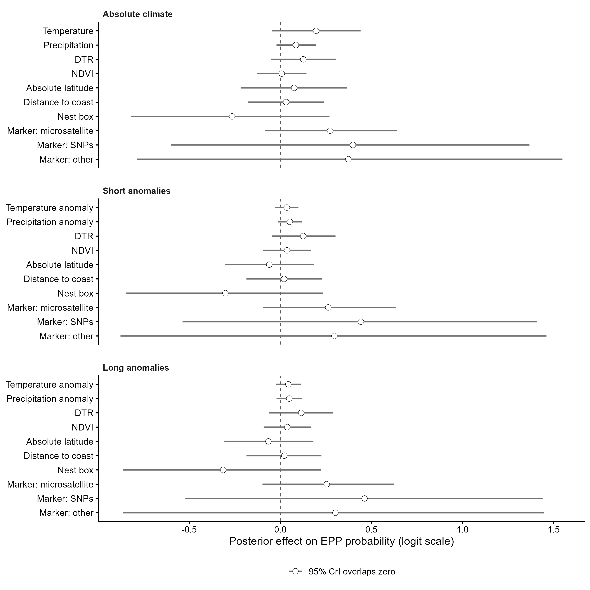

```{r}
#| label: setup
#| message: false
#| warning: false

library(brms)
library(dplyr)
library(performance)
library(knitr)
```

# Aim

The aim of this analysis is to test whether variation in extra-pair paternity (EPP) is associated with environmental conditions experienced during the breeding season.

To evaluate different environmental hypotheses, three Bayesian phylogenetic beta-binomial models were fitted:

1.  **Absolute climate model** - testing associations between EPP and local temperature, precipitation, diurnal temperature range (DTR), and habitat productivity (NDVI).
2.  **Short-term anomaly model** - testing whether EPP is associated with deviations in temperature and precipitation relative to recent local conditions (5-year anomalies).
3.  **Long-term anomaly model** - testing whether EPP is associated with deviations in temperature and precipitation relative to a 30-year local climatic baseline.

All models additionally include a common set of geographic and methodological moderators:

- absolute latitude,
- distance to coast,
- nest-box use,
- genetic marker type.

These variables were included to account for broad geographic gradients and methodological differences among studies that may influence estimates of EPP.

All models further account for population-level variation, species identity, and phylogenetic relatedness among species through random effects.

Together, these models allow us to distinguish whether EPP is more strongly associated with absolute environmental conditions, short-term environmental fluctuations, or departures from long-term climatic expectations.

All continuous predictors are standardised to mean 0 and standard deviation 1. Absolute precipitation is log-transformed as `log(x + 1)` before standardisation to reduce skewness.

### Model structure

For each record (i):

$$y_i \sim \mathrm{BetaBinomial}(N_i, p_i, \phi)$$

where (y_i) is the number of broods with EPP and (N_i) is the total number of sampled broods.

The linear predictor is:

$$\mathrm{logit}(p_i) =
\alpha +
\beta X_i +
u_{\mathrm{population}[i]} +
u_{\mathrm{species}[i]} +
u_{\mathrm{phylo}[i]}$$

where (u\_{\mathrm{population}}) is a population-level random intercept, (u\_{\mathrm{species}}) is a non-phylogenetic species-level random intercept, and (u\_{\mathrm{phylo}}) is a phylogenetic random effect based on the Clements tree.

## Load Prepared Data

```{r}
#| label: load-data

dat_model_phylo <- readRDS("data/processed/dat_model_phylo.rds")
phylo_mat <- readRDS("data/processed/phylo_mat.rds")
```

### Prepare Model Data

```{r}
#| label: prepare-data

z <- function(x) {
  as.numeric(scale(x))
}

complete_model_data <- function(data, vars) {
  data <- data[
    !is.na(data$n_epp_broods) &
      !is.na(data$n_broods_sampled) &
      data$n_broods_sampled > 0 &
      data$n_epp_broods <= data$n_broods_sampled,
  ]

  data <- data[complete.cases(data[, vars]), ]
  droplevels(data)
}

dat_env <- dat_model_phylo

dat_env$nest_box <- as.factor(dat_env$nest_box)
dat_env$marker_type <- as.factor(dat_env$marker_type)
dat_env$population_id <- as.factor(dat_env$population_id)
dat_env$species_nonphylo <- as.factor(dat_env$species_nonphylo)
dat_env$species_phylo <- as.factor(dat_env$species_phylo)

dat_env$abs_latitude_z <- z(dat_env$abs_latitude)
dat_env$distance_to_coast_z <- z(dat_env$distance_to_coast_km)

dat_env$tmp_cru_C_first_month_z <- z(dat_env$tmp_cru_C_first_month)
dat_env$pre_cru_mm_first_month_log_z <- z(log1p(dat_env$pre_cru_mm_first_month))
dat_env$dtr_cru_C_first_month_z <- z(dat_env$dtr_cru_C_first_month)
dat_env$ndvi_first_month_median_30km_z <- z(dat_env$ndvi_first_month_median_30km)

dat_env$tmp_short_anom_5yr_C_first_month_z <- z(dat_env$tmp_short_anom_5yr_C_first_month)
dat_env$pre_short_anom_5yr_mm_first_month_z <- z(dat_env$pre_short_anom_5yr_mm_first_month)

dat_env$tmp_long_anom_1961_1989_C_first_month_z <- z(dat_env$tmp_long_anom_1961_1989_C_first_month)
dat_env$pre_long_anom_1961_1989_mm_first_month_z <- z(dat_env$pre_long_anom_1961_1989_mm_first_month)

```

### Complete Datasets

```{r}
#| label: complete-datasets

common_vars <- c(
  "n_epp_broods",
  "n_broods_sampled",
  "abs_latitude_z",
  "distance_to_coast_z",
  "nest_box",
  "marker_type",
  "population_id",
  "species_nonphylo",
  "species_phylo"
)

absolute_vars <- c(
  common_vars,
  "tmp_cru_C_first_month_z",
  "pre_cru_mm_first_month_log_z",
  "dtr_cru_C_first_month_z",
  "ndvi_first_month_median_30km_z"
)

short_vars <- c(
  common_vars,
  "tmp_short_anom_5yr_C_first_month_z",
  "pre_short_anom_5yr_mm_first_month_z",
  "dtr_cru_C_first_month_z",
  "ndvi_first_month_median_30km_z"
)

long_vars <- c(
  common_vars,
  "tmp_long_anom_1961_1989_C_first_month_z",
  "pre_long_anom_1961_1989_mm_first_month_z",
  "dtr_cru_C_first_month_z",
  "ndvi_first_month_median_30km_z"
)

dat_env_absolute <- complete_model_data(dat_env, absolute_vars)
dat_env_short <- complete_model_data(dat_env, short_vars)
dat_env_long <- complete_model_data(dat_env, long_vars)

model_data_checks <- data.frame(
  model = c(
    "absolute climate",
    "short anomalies",
    "long anomalies"
  ),
  records = c(
    nrow(dat_env_absolute),
    nrow(dat_env_short),
    nrow(dat_env_long)
  ),
  species = c(
    length(unique(dat_env_absolute$species_phylo)),
    length(unique(dat_env_short$species_phylo)),
    length(unique(dat_env_long$species_phylo))
  ),
  populations = c(
    length(unique(dat_env_absolute$population_id)),
    length(unique(dat_env_short$population_id)),
    length(unique(dat_env_long$population_id))
  )
)

kable(model_data_checks)
```

## First-Month and Full-Season Environmental Variables

Because the main models use first-month environmental predictors, we checked whether first-month values were correlated with corresponding full-season summaries.

```{r}
#| label: first-month-full-season-correlations

first_full_cor <- function(data, first_var, full_var, label) {
  keep <- complete.cases(data[, c(first_var, full_var)])
  test <- cor.test(
    data[[first_var]][keep],
    data[[full_var]][keep],
    method = "pearson"
  )

  data.frame(
    variable = label,
    n = sum(keep),
    r = unname(test$estimate),
    p_value = test$p.value
  )
}

first_full_correlations <- bind_rows(
  first_full_cor(
    dat_env,
    "tmp_cru_C_first_month",
    "tmp_cru_C_full_season",
    "Temperature"
  ),
  first_full_cor(
    dat_env,
    "pre_cru_mm_first_month",
    "pre_cru_mm_full_season",
    "Precipitation"
  ),
  first_full_cor(
    dat_env,
    "dtr_cru_C_first_month",
    "dtr_cru_C_full_season",
    "DTR"
  ),
  first_full_cor(
    dat_env,
    "ndvi_first_month_median_30km",
    "ndvi_full_season_median_30km",
    "NDVI"
  )
)

kable(first_full_correlations, digits = 3)
```

```{r}
#| label: first-month-full-season-correlation-figure
#| fig-width: 8
#| fig-height: 6

knitr::include_graphics(
  "figures/first_month_full_season_correlations.png"
)
```

## Collinearity Diagnostics

The following linear models are used only to check collinearity among fixed predictors before fitting the Bayesian beta-binomial models.

## Absolute Climate Model

```{r}
#| label: collinearity-absolute

lm_env_absolute <- lm(
  I(n_epp_broods / n_broods_sampled) ~
    abs_latitude_z +
    distance_to_coast_z +
    nest_box +
    marker_type +
    tmp_cru_C_first_month_z +
    pre_cru_mm_first_month_log_z +
    dtr_cru_C_first_month_z +
    ndvi_first_month_median_30km_z,
  data = dat_env_absolute
)

check_collinearity(lm_env_absolute)
```

## Short Anomaly Model

```{r}
#| label: collinearity-short

lm_env_short <- lm(
  I(n_epp_broods / n_broods_sampled) ~
    abs_latitude_z +
    distance_to_coast_z +
    nest_box +
    marker_type +
    tmp_short_anom_5yr_C_first_month_z +
    pre_short_anom_5yr_mm_first_month_z +
    dtr_cru_C_first_month_z +
    ndvi_first_month_median_30km_z,
  data = dat_env_short
)

check_collinearity(lm_env_short)
```

## Long Anomaly Model

```{r}
#| label: collinearity-long

lm_env_long <- lm(
  I(n_epp_broods / n_broods_sampled) ~
    abs_latitude_z +
    distance_to_coast_z +
    nest_box +
    marker_type +
    tmp_long_anom_1961_1989_C_first_month_z +
    pre_long_anom_1961_1989_mm_first_month_z +
    dtr_cru_C_first_month_z +
    ndvi_first_month_median_30km_z,
  data = dat_env_long
)

check_collinearity(lm_env_long)
```

## Priors

```{r}
#| label: priors

priors_env <- c(
  prior(normal(0, 2), class = "Intercept"),
  prior(normal(0, 1), class = "b"),
  prior(exponential(1), class = "sd")
)
```

## Model 1: Absolute Climate and NDVI

This model tests whether EPP is associated with absolute first-month temperature, precipitation, DTR and vegetation productivity.

```{r}
#| label: fit-absolute-on-totoro
#| eval: false

m_env_absolute <- brm(
  n_epp_broods | trials(n_broods_sampled) ~
    abs_latitude_z +
    distance_to_coast_z +
    nest_box +
    marker_type +
    tmp_cru_C_first_month_z +
    pre_cru_mm_first_month_log_z +
    dtr_cru_C_first_month_z +
    ndvi_first_month_median_30km_z +
    (1 | population_id) +
    (1 | species_nonphylo) +
    (1 | gr(species_phylo, cov = phylo_mat)),
  data = dat_env_absolute,
  data2 = list(phylo_mat = phylo_mat),
  family = beta_binomial(link = "logit", link_phi = "log"),
  prior = priors_env,
  chains = 4,
  cores = 4,
  iter = 10000,
  warmup = 5000,
  control = list(adapt_delta = 0.99, max_treedepth = 15),
  seed = 201,
  save_pars = save_pars(all = TRUE)
)
```

### Summary

```{r}
#| label: load-summary-env-absolute
#| message: false
#| warning: false

m_env_absolute <- readRDS("models/m_env_absolute.rds")

summary(m_env_absolute)
```

## Model 2: Short-Term Anomalies and NDVI

This model tests whether EPP is associated with temperature and precipitation anomalies relative to the preceding five years.

```{r}
#| label: fit-short-on-totoro
#| eval: false

m_env_short <- brm(
  n_epp_broods | trials(n_broods_sampled) ~
    abs_latitude_z +
    distance_to_coast_z +
    nest_box +
    marker_type +
    tmp_short_anom_5yr_C_first_month_z +
    pre_short_anom_5yr_mm_first_month_z +
    dtr_cru_C_first_month_z +
    ndvi_first_month_median_30km_z +
    (1 | population_id) +
    (1 | species_nonphylo) +
    (1 | gr(species_phylo, cov = phylo_mat)),
  data = dat_env_short,
  data2 = list(phylo_mat = phylo_mat),
  family = beta_binomial(link = "logit", link_phi = "log"),
  prior = priors_env,
  chains = 4,
  cores = 4,
  iter = 10000,
  warmup = 5000,
  control = list(adapt_delta = 0.99, max_treedepth = 15),
  seed = 211,
  save_pars = save_pars(all = TRUE)
)
```

### Summary

```{r}
#| label: load-summary-env-short
#| message: false
#| warning: false

m_env_short <- readRDS("models/m_env_short.rds")

summary(m_env_short)
```

## Model 3: Long-Term Anomalies and NDVI

This model tests whether EPP is associated with temperature and precipitation anomalies relative to the 1961-1989 climatological baseline.

```{r}
#| label: fit-long-on-totoro
#| eval: false

m_env_long <- brm(
  n_epp_broods | trials(n_broods_sampled) ~
    abs_latitude_z +
    distance_to_coast_z +
    nest_box +
    marker_type +
    tmp_long_anom_1961_1989_C_first_month_z +
    pre_long_anom_1961_1989_mm_first_month_z +
    dtr_cru_C_first_month_z +
    ndvi_first_month_median_30km_z +
    (1 | population_id) +
    (1 | species_nonphylo) +
    (1 | gr(species_phylo, cov = phylo_mat)),
  data = dat_env_long,
  data2 = list(phylo_mat = phylo_mat),
  family = beta_binomial(link = "logit", link_phi = "log"),
  prior = priors_env,
  chains = 4,
  cores = 4,
  iter = 10000,
  warmup = 5000,
  control = list(adapt_delta = 0.99, max_treedepth = 15),
  seed = 221,
  save_pars = save_pars(all = TRUE)
)
```

### Summary

```{r}
#| label: load-summary-env-long
#| message: false
#| warning: false

m_env_long <- readRDS("models/m_env_long.rds")

summary(m_env_long)
```

## Posterior Predictive Checks

```{r}
#| label: posterior-predictive-checks
#| fig-width: 8
#| fig-height: 5

knitr::include_graphics(
  c(
    "figures/pp_check_env_absolute.png",
    "figures/pp_check_env_short.png",
    "figures/pp_check_env_long.png"
  )
)
```

## Summary Figure

```{r}
#| label: environmental-effects-forest-plot
#| fig-width: 9
#| fig-height: 9


```
