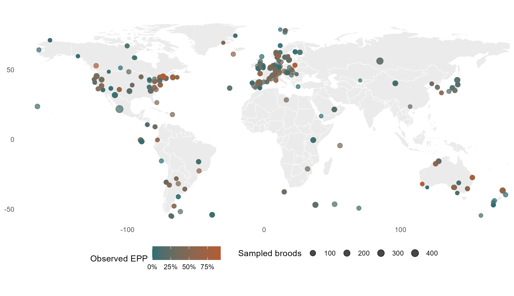
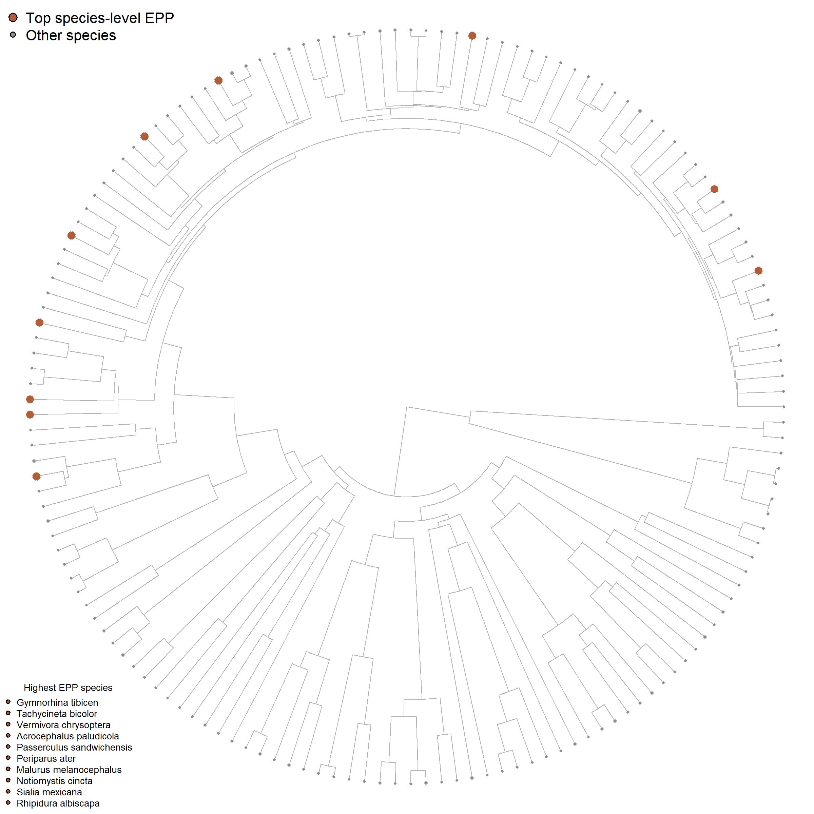
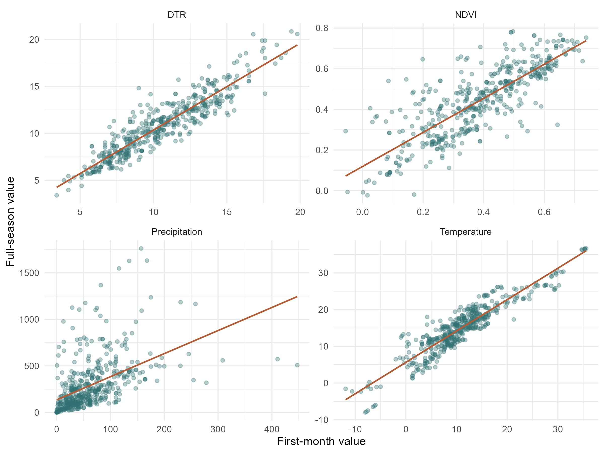
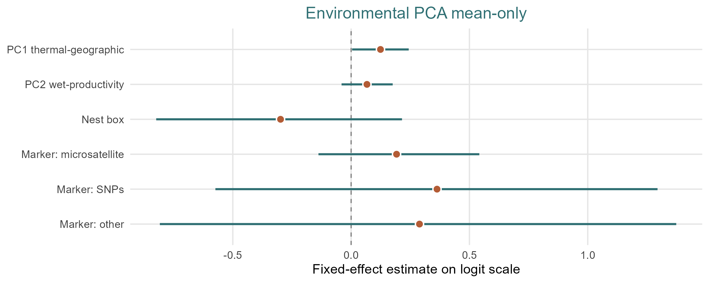
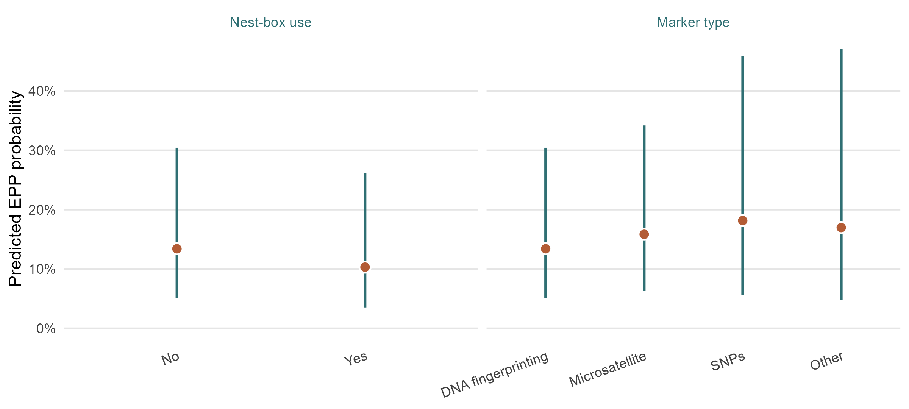
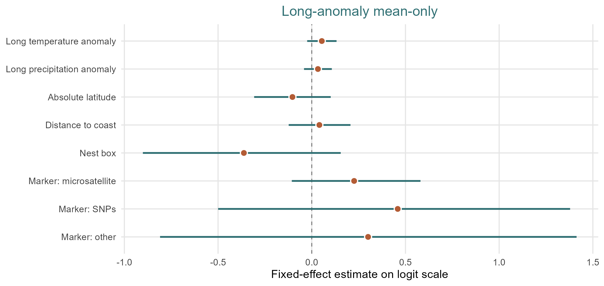
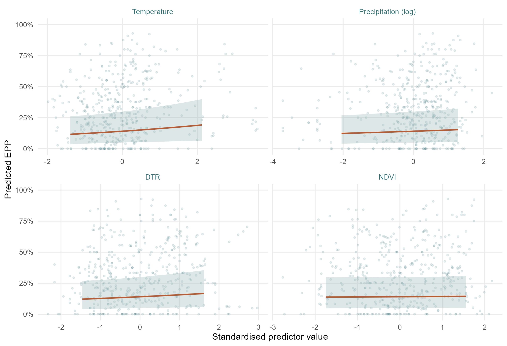
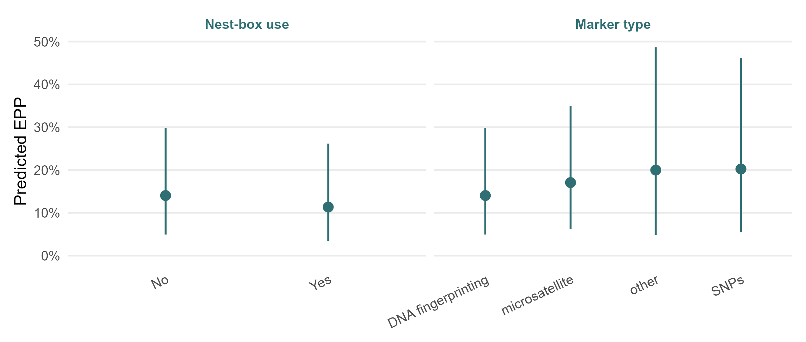
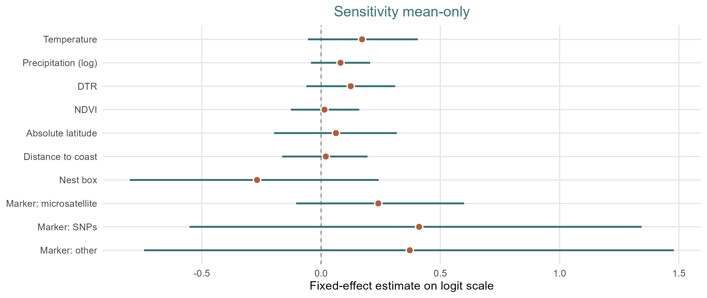

---
title: "Figures"
---

```{r}
#| label: figures-setup
#| echo: true
#| message: false
#| warning: false

library(knitr)
library(dplyr)
library(ggplot2)
library(readr)
library(tibble)
library(tidyr)
library(purrr)

dir.create("figures", recursive = TRUE, showWarnings = FALSE)

plot_green <- "#2f6f73"
plot_green_light <- "#9fb9bd"
plot_rust <- "#b35c35"
plot_neutral <- "#5f6f72"

first_existing <- function(paths) {
  existing <- paths[file.exists(paths)]
  if (length(existing) == 0) {
    return(NA_character_)
  }
  existing[1]
}

sensitivity_model_dir <- "models/sensitivity_models"
```

This chapter collects figures used in the  workflow.
## Sampling Locations

This map shows the geographic distribution of population-level EPP records included in the model-ready dataset. Point colour represents the observed proportion of broods containing at least one extra-pair young, while point size represents the number of sampled broods. The figure is intended to show the spatial coverage of the dataset and the uneven distribution of sampling effort across regions.


```{r}
#| label: create-sampling-location-map
#| eval: false
#| message: false
#| warning: false

dat_location_file <- first_existing(c(
  "data/processed/dat_model_phylo.rds",
  "data/processed/dat_model.rds"
))

if (!is.na(dat_location_file)) {
  dat_locations <- readRDS(dat_location_file) %>%
    mutate(
      observed_epp = n_epp_broods / n_broods_sampled
    ) %>%
    filter(
      !is.na(lat),
      !is.na(long),
      !is.na(observed_epp),
      n_broods_sampled > 0
    )

  if (requireNamespace("maps", quietly = TRUE)) {
    world_map <- ggplot2::map_data("world")

    fig_sampling_locations <- ggplot() +
      geom_polygon(
        data = world_map,
        aes(x = long, y = lat, group = group),
        fill = "grey92",
        colour = "white",
        linewidth = 0.2
      ) +
      geom_point(
        data = dat_locations,
        aes(x = long, y = lat, colour = observed_epp, size = n_broods_sampled),
        alpha = 0.72
      ) +
      coord_quickmap(xlim = c(-180, 180), ylim = c(-60, 85), expand = FALSE) +
      scale_colour_gradient(
        low = plot_green,
        high = plot_rust,
        labels = scales::percent_format(accuracy = 1)
      ) +
      scale_size_continuous(range = c(1, 4), trans = "sqrt") +
      labs(
        x = NULL,
        y = NULL,
        colour = "Observed EPP",
        size = "Sampled broods"
      ) +
      theme_minimal(base_size = 11) +
      theme(
        panel.grid = element_blank(),
        legend.position = "bottom"
      )
  } else {
    fig_sampling_locations <- ggplot(
      dat_locations,
      aes(x = long, y = lat, colour = observed_epp, size = n_broods_sampled)
    ) +
      geom_point(alpha = 0.72) +
      coord_quickmap(xlim = c(-180, 180), ylim = c(-60, 85), expand = FALSE) +
      scale_colour_gradient(
        low = plot_green,
        high = plot_rust,
        labels = scales::percent_format(accuracy = 1)
      ) +
      scale_size_continuous(range = c(1, 4), trans = "sqrt") +
      labs(
        x = "Longitude",
        y = "Latitude",
        colour = "Observed EPP",
        size = "Sampled broods"
      ) +
      theme_minimal(base_size = 11) +
      theme(legend.position = "bottom")
  }

  ggsave(
    "figures/sampling_locations_map.png",
    fig_sampling_locations,
    width = 9,
    height = 5.2,
    dpi = 300
  )

  ggsave(
    "figures/sampling_locations_map.pdf",
    fig_sampling_locations,
    width = 9,
    height = 5.2
  )
} else {
  cat("Model-ready data are not available yet.")
}
```

```{r}
#| label: fig-sampling-location-map
#| echo: true
#| fig-width: 9
#| fig-height: 5.2

if (file.exists("figures/sampling_locations_map.png")) {
  
} else {
  cat("Sampling-location map is not available yet.")
}
```

This figure is used in the data-preparation chapter. Each point is a sampled population; point colour shows the observed EPP proportion and point size shows the number of sampled broods.

## Phylogenetic Distribution of High-EPP Species

This figure shows the phylogenetic distribution of species with the highest observed species-level EPP rates. Highlighted tips represent the species with the highest aggregate EPP estimates among species included in the pruned phylogeny. The figure is descriptive and is used to illustrate that high EPP values are distributed across the avian phylogeny rather than being restricted to a single narrow clade.


```{r}
#| label: create-high-epp-phylogeny
#| eval: false
#| message: false
#| warning: false

tree_file <- "data/processed/tree_pruned.rds"
dat_phylo_file <- "data/processed/dat_model_phylo.rds"

if (file.exists(tree_file) &&
    file.exists(dat_phylo_file) &&
    requireNamespace("ape", quietly = TRUE)) {
  tree_pruned <- readRDS(tree_file)
  dat_phylo <- readRDS(dat_phylo_file)

  high_epp_species <- dat_phylo %>%
    filter(
      !is.na(species_phylo),
      !is.na(n_epp_broods),
      !is.na(n_broods_sampled),
      n_broods_sampled > 0
    ) %>%
    group_by(species_phylo) %>%
    summarise(
      n_records = n(),
      total_broods = sum(n_broods_sampled),
      total_epp_broods = sum(n_epp_broods),
      species_epp_rate = total_epp_broods / total_broods,
      .groups = "drop"
    ) %>%
    filter(species_phylo %in% tree_pruned$tip.label) %>%
    arrange(desc(species_epp_rate), desc(total_broods)) %>%
    slice_head(n = 10)

  write_csv(
    high_epp_species,
    "figures/high_epp_species_for_phylogeny.csv"
  )

  top_species <- high_epp_species$species_phylo
  tip_colours <- ifelse(tree_pruned$tip.label %in% top_species, plot_rust, "grey55")

  make_phylogeny_plot <- function() {
    ape::plot.phylo(
      tree_pruned,
      type = "fan",
      show.tip.label = FALSE,
      edge.color = "grey70",
      edge.width = 0.7,
      no.margin = TRUE
    )

    ape::tiplabels(
      pch = 21,
      bg = tip_colours,
      col = "white",
      cex = ifelse(tree_pruned$tip.label %in% top_species, 1.1, 0.45),
      lwd = 0.25
    )

    legend(
      "topleft",
      legend = c("Top species-level EPP", "Other species"),
      pt.bg = c(plot_rust, "grey55"),
      pch = 21,
      pt.cex = c(1.1, 0.7),
      bty = "n",
      cex = 0.85
    )

    legend(
      "bottomleft",
      legend = gsub("_", " ", top_species),
      pch = 21,
      pt.bg = plot_rust,
      bty = "n",
      cex = 0.55,
      title = "Highest EPP species"
    )
  }

  png("figures/high_epp_species_phylogeny.png", width = 2400, height = 2400, res = 300)
  make_phylogeny_plot()
  dev.off()

  pdf("figures/high_epp_species_phylogeny.pdf", width = 8, height = 8)
  make_phylogeny_plot()
  dev.off()
} else {
  cat("Phylogenetic tree, model-ready data, or the ape package is not available yet.")
}
```

```{r}
#| label: fig-high-epp-phylogeny
#| echo: true
#| fig-width: 8
#| fig-height: 8

if (file.exists("figures/high_epp_species_phylogeny.png")) {
  
} else {
  cat("High-EPP phylogeny figure is not available yet.")
}
```

This figure is used in the taxonomy and phylogeny chapter. Highlighted tips identify species with the highest observed species-level EPP values and show their distribution across the pruned phylogeny.

## First Month vs Full Season

This figure compares environmental values extracted for the first breeding-season month with values extracted across the full breeding season. Stronger correspondence indicates that the first-month measure captures much of the same environmental variation as the full-season measure, whereas weaker correspondence suggests that the two temporal windows may capture different aspects of breeding-season conditions. This comparison supports the choice and interpretation of temporal windows used in the environmental models.


```{r}
#| label: create-first-full-season-figure
#| eval: false
#| message: false
#| warning: false

dat_model_file <- "data/processed/dat_model.rds"

if (file.exists(dat_model_file)) {
  dat_model <- readRDS(dat_model_file)

  environment_window_pairs <- tribble(
    ~variable, ~first_month, ~full_season,
    "Temperature", "tmp_cru_C_first_month", "tmp_cru_C_full_season",
    "Precipitation", "pre_cru_mm_first_month", "pre_cru_mm_full_season",
    "DTR", "dtr_cru_C_first_month", "dtr_cru_C_full_season",
    "NDVI", "ndvi_first_month_median_30km", "ndvi_full_season_median_30km"
  )

  environment_window_plot_data <- purrr::pmap_dfr(
    environment_window_pairs,
    function(variable, first_month, full_season) {
      dat_model %>%
        transmute(
          variable = variable,
          first_month = .data[[first_month]],
          full_season = .data[[full_season]]
        ) %>%
        drop_na()
    }
  )

  fig_first_full_season <- ggplot(
    environment_window_plot_data,
    aes(x = first_month, y = full_season)
  ) +
    geom_point(alpha = 0.35, size = 1.4, colour = plot_green) +
    geom_smooth(method = "lm", se = FALSE, linewidth = 0.7, colour = plot_rust) +
    facet_wrap(~ variable, scales = "free", ncol = 2) +
    labs(
      x = "First-month value",
      y = "Full-season value"
    ) +
    theme_minimal(base_size = 11)

  ggsave(
    "figures/first_month_full_season_correlations.png",
    fig_first_full_season,
    width = 8,
    height = 6,
    dpi = 300
  )

  ggsave(
    "figures/first_month_full_season_correlations.pdf",
    fig_first_full_season,
    width = 8,
    height = 6
  )
} else {
  cat("data/processed/dat_model.rds is not available yet. Render Data preparation first.")
}
```

```{r}
#| label: fig-first-full-season
#| echo: true
#| fig-width: 8
#| fig-height: 6

if (file.exists("figures/first_month_full_season_correlations.png")) {
  
} else {
  cat("Environmental-window correlation figure is not available yet.")
}
```

This figure is used in the data-preparation chapter. Points compare first-month and full-season environmental values; strong correspondence supports using first-month predictors in the later models.

## Environmental PCA

This figure summarises the construction of the environmental-geographic PCA. Panel A shows the proportion of variance explained by each principal component, and Panel B shows the loadings of the original environmental and geographic variables on the first two retained axes. These loadings are used to interpret PC1 as a thermal-geographic gradient and PC2 as a wet-productivity gradient.


```{r}
#| label: create-pca-figures
#| eval: false
#| message: false
#| warning: false

pca_model_set_dir <- "models/pca_environment_model_set"
pca_legacy_dir <- "models/pca_environment"

variance_file <- first_existing(c(
  file.path(pca_model_set_dir, "pca_variance_explained_environment_geography.csv"),
  file.path(pca_legacy_dir, "pca_variance_explained_environment_geography.csv")
))

loadings_file <- first_existing(c(
  file.path(pca_model_set_dir, "pca_loadings_environment_geography.csv"),
  file.path(pca_legacy_dir, "pca_loadings_environment_geography.csv")
))

if (!is.na(variance_file)) {
  variance_explained <- read_csv(variance_file, show_col_types = FALSE)

  fig_pca_variance <- variance_explained %>%
    mutate(PC = factor(PC, levels = PC)) %>%
    ggplot(aes(x = PC, y = variance_explained)) +
    geom_col(width = 0.7, fill = plot_green) +
    geom_point(aes(y = cumulative_variance), colour = plot_rust, size = 2) +
    geom_line(aes(y = cumulative_variance, group = 1), colour = plot_rust) +
    scale_y_continuous(labels = scales::percent_format(accuracy = 1)) +
    labs(x = NULL, y = "Variance explained") +
    theme_minimal(base_size = 11)

  ggsave(
    "figures/pca_variance_explained.png",
    fig_pca_variance,
    width = 6.5,
    height = 4.5,
    dpi = 300
  )

  ggsave(
    "figures/pca_variance_explained.pdf",
    fig_pca_variance,
    width = 6.5,
    height = 4.5
  )
} else {
  cat("PCA variance file is not available yet. Run the PCA model script first.")
}

if (!is.na(loadings_file)) {
  loadings <- read_csv(loadings_file, show_col_types = FALSE)

  if (!"PC1_thermal_geographic" %in% names(loadings) && "PC1" %in% names(loadings)) {
    loadings <- loadings %>%
      mutate(PC1_thermal_geographic = PC1)
  }

  if (!"PC2_wet_productive" %in% names(loadings) && "PC2" %in% names(loadings)) {
    loadings <- loadings %>%
      mutate(PC2_wet_productive = -PC2)
  }

  fig_pca_loadings <- loadings %>%
    select(variable, PC1_thermal_geographic, PC2_wet_productive) %>%
    pivot_longer(
      c(PC1_thermal_geographic, PC2_wet_productive),
      names_to = "axis",
      values_to = "loading"
    ) %>%
    mutate(
      axis = recode(axis,
        PC1_thermal_geographic = "PC1 thermal-geographic",
        PC2_wet_productive = "PC2 wet-productivity"
      )
    ) %>%
    ggplot(aes(x = loading, y = reorder(variable, loading), fill = loading)) +
    geom_col(width = 0.7) +
    facet_wrap(~ axis, scales = "free_x") +
    scale_fill_gradient2(
      low = "#6b8fb5",
      mid = "#f7f4ef",
      high = plot_rust,
      midpoint = 0
    ) +
    labs(x = "Loading", y = NULL) +
    theme_minimal(base_size = 11) +
    theme(legend.position = "none")

  ggsave(
    "figures/pca_loadings.png",
    fig_pca_loadings,
    width = 8,
    height = 4.8,
    dpi = 300
  )

  ggsave(
    "figures/pca_loadings.pdf",
    fig_pca_loadings,
    width = 8,
    height = 4.8
  )
} else {
  cat("PCA loading file is not available yet. Run the PCA model script first.")
}

if (exists("fig_pca_variance") && exists("fig_pca_loadings")) {
  panel_a <- fig_pca_variance +
    ggplot2::labs(title = "A. Variance explained") +
    ggplot2::theme(plot.title = ggplot2::element_text(face = "bold", colour = "#1f4d3a"))

  panel_b <- fig_pca_loadings +
    ggplot2::labs(title = "B. PCA loadings") +
    ggplot2::theme(plot.title = ggplot2::element_text(face = "bold", colour = "#1f4d3a"))

  if (requireNamespace("patchwork", quietly = TRUE)) {
    fig_environmental_pca <- panel_a + panel_b +
      patchwork::plot_layout(widths = c(0.8, 1.45))
  } else if (requireNamespace("gridExtra", quietly = TRUE)) {
    fig_environmental_pca <- gridExtra::arrangeGrob(
      panel_a,
      panel_b,
      ncol = 2,
      widths = c(0.8, 1.45)
    )
  } else {
    fig_environmental_pca <- grid::grid.grabExpr({
      grid::grid.newpage()
      grid::pushViewport(grid::viewport(
        layout = grid::grid.layout(1, 2, widths = grid::unit(c(0.8, 1.45), "null"))
      ))
      print(panel_a, vp = grid::viewport(layout.pos.row = 1, layout.pos.col = 1))
      print(panel_b, vp = grid::viewport(layout.pos.row = 1, layout.pos.col = 2))
    })
  }

  ggsave(
    "figures/pca_environmental_pca.png",
    fig_environmental_pca,
    width = 10.5,
    height = 4.8,
    dpi = 300
  )

  ggsave(
    "figures/pca_environmental_pca.pdf",
    fig_environmental_pca,
    width = 10.5,
    height = 4.8
  )
}
```

```{r}
#| label: fig-environmental-pca
#| echo: true
#| fig-width: 10.5
#| fig-height: 4.8

if (file.exists("figures/pca_environmental_pca.png")) {
  include_graphics("figures/pca_environmental_pca.png")
} else {
  cat("Environmental PCA figure is not available yet.")
}
```

This figure is used in the PCA chapter. Panel A shows variance explained by each component, and Panel B shows variable loadings used to interpret the retained environmental-geographic gradients.


## Main models plots

These figures summarise the main model visual outputs, including fixed-effect estimates from the three mean-only main environmental models and model-predicted effects for methodological controls in the PCA model. Points show posterior estimates and horizontal intervals show 95% credible intervals on the logit scale. Intervals overlapping zero indicate effects with substantial posterior uncertainty. Categorical effects are contrasts against the reference groups: nest box = no and marker type = DNA fingerprinting; the Nest box estimate compares records with nest-box use to records without nest-box use.

```{r}
#| label: create-main-mean-forest-plots
#| eval: false
#| message: false
#| warning: false

main_fixed_effects_file <- file.path(
  "models/main_environmental_models",
  "fixed_effects_main_environmental_models.csv"
)

main_mean_models <- tribble(
  ~model, ~file_stem, ~title,
  "Environmental PCA mean-only", "main_pca_mean_forest_plot", "Environmental PCA mean-only",
  "Short-anomaly mean-only", "main_short_mean_forest_plot", "Short-anomaly mean-only",
  "Long-anomaly mean-only", "main_long_mean_forest_plot", "Long-anomaly mean-only"
)

main_predictor_labels <- c(
  "PC1 thermal-geographic" = "PC1 thermal-geographic",
  "PC2 wet-productivity" = "PC2 wet-productivity",
  "Short temperature anomaly" = "Short temperature anomaly",
  "Short precipitation anomaly" = "Short precipitation anomaly",
  "Long temperature anomaly" = "Long temperature anomaly",
  "Long precipitation anomaly" = "Long precipitation anomaly",
  "Absolute latitude" = "Absolute latitude",
  "Distance to coast" = "Distance to coast",
  "Nest box" = "Nest box",
  "Marker: microsatellite" = "Marker: microsatellite",
  "Marker: SNPs" = "Marker: SNPs",
  "Marker: other" = "Marker: other"
)

main_predictor_order <- list(
  "Environmental PCA mean-only" = c(
    "PC1 thermal-geographic", "PC2 wet-productivity",
    "Nest box", "Marker: microsatellite", "Marker: SNPs", "Marker: other"
  ),
  "Short-anomaly mean-only" = c(
    "Short temperature anomaly", "Short precipitation anomaly",
    "Absolute latitude", "Distance to coast",
    "Nest box", "Marker: microsatellite", "Marker: SNPs", "Marker: other"
  ),
  "Long-anomaly mean-only" = c(
    "Long temperature anomaly", "Long precipitation anomaly",
    "Absolute latitude", "Distance to coast",
    "Nest box", "Marker: microsatellite", "Marker: SNPs", "Marker: other"
  )
)

if (file.exists(main_fixed_effects_file)) {
  main_fixed_effects <- read_csv(main_fixed_effects_file, show_col_types = FALSE) %>%
    mutate(
      model = gsub("Short anomaly", "Short-anomaly", model, fixed = TRUE),
      model = gsub("Long anomaly", "Long-anomaly", model, fixed = TRUE),
      predictor = recode(predictor, !!!main_predictor_labels)
    ) %>%
    filter(component == "mu", model %in% main_mean_models$model)

  make_main_mean_forest <- function(model, file_stem, title) {
    predictor_levels <- main_predictor_order[[model]]
    plot_data <- main_fixed_effects %>%
      filter(.data$model == .env$model) %>%
      mutate(
        predictor = factor(
          predictor,
          levels = rev(predictor_levels[predictor_levels %in% predictor])
        )
      )

    if (nrow(plot_data) == 0) {
      cat("No fixed-effect estimates found for ", model, ".\n", sep = "")
      return(invisible(NULL))
    }

    fig <- ggplot(plot_data, aes(x = estimate, y = predictor)) +
      geom_vline(xintercept = 0, linetype = "dashed", linewidth = 0.4, colour = "grey45") +
      geom_segment(aes(x = lower, xend = upper, y = predictor, yend = predictor), linewidth = 0.8, colour = plot_green) +
      geom_point(size = 2.6, shape = 21, fill = plot_rust, colour = "white", stroke = 0.8) +
      labs(
        title = title,
        x = "Fixed-effect estimate on logit scale",
        y = NULL
      ) +
      theme_minimal(base_size = 11) +
      theme(
        plot.title = element_text(hjust = 0.5, colour = plot_green, face = "plain"),
        axis.text.y = element_text(colour = "grey25"),
        axis.text.x = element_text(colour = "grey25"),
        panel.grid.minor = element_blank(),
        panel.grid.major.y = element_line(colour = "grey90"),
        panel.grid.major.x = element_line(colour = "grey90")
      )

    ggsave(
      file.path("figures", paste0(file_stem, ".png")),
      fig,
      width = 8,
      height = ifelse(nrow(plot_data) <= 6, 3.2, 3.8),
      dpi = 300
    )

    ggsave(
      file.path("figures", paste0(file_stem, ".pdf")),
      fig,
      width = 8,
      height = ifelse(nrow(plot_data) <= 6, 3.2, 3.8)
    )
  }

  pwalk(main_mean_models, make_main_mean_forest)
} else {
  cat("Main model fixed-effect summaries are not available yet.")
}
```

```{r}
#| label: create-main-pca-controls-effects
#| eval: false
#| message: false
#| warning: false

main_pca_mu_model_file <- file.path(
  "models/main_environmental_models",
  "m_main_pca_mu.rds"
)
main_pca_data_file <- file.path(
  "models/main_environmental_models",
  "dat_main_environmental_models.rds"
)

if (file.exists(main_pca_mu_model_file) && file.exists(main_pca_data_file)) {
  main_pca_mu_model <- readRDS(main_pca_mu_model_file)
  dat_main_pca <- readRDS(main_pca_data_file) %>%
    mutate(
      nest_box = factor(nest_box),
      marker_type = factor(marker_type),
      population_id = factor(population_id),
      species_nonphylo = factor(species_nonphylo),
      species_phylo = factor(species_phylo)
    )

  ref_row <- dat_main_pca[1, , drop = FALSE]
  ref_row$PC1_thermal_geographic <- 0
  ref_row$PC2_wet_productive <- 0
  ref_row$n_broods_sampled <- 1
  ref_row$n_epp_broods <- 0
  ref_row$nest_box <- factor("no", levels = levels(dat_main_pca$nest_box))
  ref_row$marker_type <- factor("DNA fingerprinting", levels = levels(dat_main_pca$marker_type))

  nest_newdata <- ref_row[rep(1, length(levels(dat_main_pca$nest_box))), , drop = FALSE]
  nest_newdata$nest_box <- factor(levels(dat_main_pca$nest_box), levels = levels(dat_main_pca$nest_box))
  nest_newdata$panel <- "Nest-box use"
  nest_newdata$level <- as.character(nest_newdata$nest_box)

  marker_newdata <- ref_row[rep(1, length(levels(dat_main_pca$marker_type))), , drop = FALSE]
  marker_newdata$marker_type <- factor(levels(dat_main_pca$marker_type), levels = levels(dat_main_pca$marker_type))
  marker_newdata$panel <- "Marker type"
  marker_newdata$level <- as.character(marker_newdata$marker_type)

  summarize_predictions <- function(newdata) {
    epred <- brms::posterior_epred(
      main_pca_mu_model,
      newdata = newdata,
      re_formula = NA
    )

    bind_rows(lapply(seq_len(ncol(epred)), function(i) {
      tibble(
        panel = newdata$panel[i],
        level = newdata$level[i],
        estimate = median(epred[, i]),
        lower = quantile(epred[, i], 0.025),
        upper = quantile(epred[, i], 0.975)
      )
    }))
  }

  main_pca_controls_plot_data <- bind_rows(
    summarize_predictions(nest_newdata),
    summarize_predictions(marker_newdata)
  ) %>%
    mutate(
      level = factor(
        level,
        levels = c("no", "yes", "DNA fingerprinting", "microsatellite", "SNPs", "other"),
        labels = c("No", "Yes", "DNA fingerprinting", "Microsatellite", "SNPs", "Other")
      ),
      panel = factor(panel, levels = c("Nest-box use", "Marker type"))
    )

  fig_main_pca_controls <- ggplot(
    main_pca_controls_plot_data,
    aes(x = level, y = estimate)
  ) +
    geom_linerange(aes(ymin = lower, ymax = upper), linewidth = 0.8, colour = plot_green) +
    geom_point(size = 2.8, shape = 21, fill = plot_rust, colour = "white", stroke = 0.8) +
    facet_wrap(~ panel, scales = "free_x", nrow = 1) +
    scale_y_continuous(labels = scales::percent_format(accuracy = 1), limits = c(0, NA)) +
    labs(
      x = NULL,
      y = "Predicted EPP probability"
    ) +
    theme_minimal(base_size = 11) +
    theme(
      strip.text = element_text(colour = plot_green, face = "plain"),
      axis.text.x = element_text(colour = "grey25", angle = 20, hjust = 1),
      axis.text.y = element_text(colour = "grey25"),
      panel.grid.minor = element_blank(),
      panel.grid.major.x = element_blank(),
      panel.grid.major.y = element_line(colour = "grey90")
    )

  ggsave(
    "figures/main_pca_controls_effects.png",
    fig_main_pca_controls,
    width = 8,
    height = 3.6,
    dpi = 300
  )

  ggsave(
    "figures/main_pca_controls_effects.pdf",
    fig_main_pca_controls,
    width = 8,
    height = 3.6
  )
}
```

```{r}
#| label: fig-main-pca-mean-forest
#| echo: true
#| fig-width: 8
#| fig-height: 3.2

if (file.exists("figures/main_pca_mean_forest_plot.png")) {
  
} else {
  cat("Environmental PCA mean-only forest plot is not available yet.")
}
```

```{r}
#| label: fig-main-pca-controls-effects
#| echo: true
#| fig-width: 8
#| fig-height: 3.6

if (file.exists("figures/main_pca_controls_effects.png")) {
  
}
```

```{r}
#| label: fig-main-short-mean-forest
#| echo: true
#| fig-width: 8
#| fig-height: 3.8

if (file.exists("figures/main_short_mean_forest_plot.png")) {
  
} else {
  cat("Short-anomaly mean-only forest plot is not available yet.")
}
```

```{r}
#| label: fig-main-long-mean-forest
#| echo: true
#| fig-width: 8
#| fig-height: 3.8

if (file.exists("figures/main_long_mean_forest_plot.png")) {
  
} else {
  cat("Long-anomaly mean-only forest plot is not available yet.")
}
```

These figures are used in the main-environmental-model chapter. Points show posterior fixed-effect estimates and horizontal bars show 95% credible intervals; intervals overlapping zero indicate effects with substantial posterior uncertainty.

## Sensitivity Environmental Effects

These figures show model-predicted EPP from the mean-only sensitivity model. The first panel focuses on the direct environmental predictors. The second panel shows the methodological moderators: nest-box use and genetic marker type. Fitted lines represent posterior mean predictions and shaded intervals show 95% credible intervals for continuous predictors; points and intervals show posterior predictions for categorical predictors. Raw population-level EPP values are shown lightly in the background for the environmental predictors only.

```{r}
#| label: create-sensitivity-environmental-effects
#| eval: false
#| message: false
#| warning: false

sensitivity_mu_model_file <- file.path(
  "models/sensitivity_models",
  "m_sensitivity_first_month_mu.rds"
)

sensitivity_data_file <- first_existing(c(
  file.path("models/sensitivity_models", "dat_sensitivity_models.rds"),
  file.path("models/sensitivity_models", "dat_fit_sensitivity_models.rds")
))

if (file.exists(sensitivity_mu_model_file) &&
    !is.na(sensitivity_data_file) &&
    requireNamespace("brms", quietly = TRUE)) {
  sensitivity_mu_model <- readRDS(sensitivity_mu_model_file)
  dat_sensitivity_effects <- readRDS(sensitivity_data_file) %>%
    mutate(
      observed_epp = n_epp_broods / n_broods_sampled,
      nest_box = factor(nest_box),
      marker_type = factor(marker_type)
    )

  sensitivity_effect_variables <- tribble(
    ~variable, ~label,
    "tmp_cru_C_first_month_z", "Temperature",
    "pre_cru_mm_first_month_log_z", "Precipitation",
    "dtr_cru_C_first_month_z", "DTR",
    "ndvi_first_month_median_30km_z", "NDVI"
  )

  make_sensitivity_effect <- function(variable, label) {
    x_range <- range(dat_sensitivity_effects[[variable]], na.rm = TRUE)
    x_grid <- seq(x_range[1], x_range[2], length.out = 80)

    newdata <- dat_sensitivity_effects[rep(1, length(x_grid)), , drop = FALSE]
    newdata$tmp_cru_C_first_month_z <- 0
    newdata$pre_cru_mm_first_month_log_z <- 0
    newdata$dtr_cru_C_first_month_z <- 0
    newdata$ndvi_first_month_median_30km_z <- 0
    newdata$abs_latitude_z <- 0
    newdata$distance_to_coast_z <- 0
    newdata$nest_box <- factor(levels(dat_sensitivity_effects$nest_box)[1], levels = levels(dat_sensitivity_effects$nest_box))
    newdata$marker_type <- factor(levels(dat_sensitivity_effects$marker_type)[1], levels = levels(dat_sensitivity_effects$marker_type))
    newdata$n_broods_sampled <- 1
    newdata[[variable]] <- x_grid

    fitted_values <- fitted(
      sensitivity_mu_model,
      newdata = newdata,
      re_formula = NA,
      scale = "response"
    )

    tibble(
      variable = label,
      x = x_grid,
      estimate = fitted_values[, "Estimate"],
      lower = fitted_values[, "Q2.5"],
      upper = fitted_values[, "Q97.5"]
    )
  }

  sensitivity_effect_plot_data <- pmap_dfr(
    sensitivity_effect_variables,
    make_sensitivity_effect
  )

  sensitivity_effect_raw_data <- pmap_dfr(
    sensitivity_effect_variables,
    function(variable, label) {
      dat_sensitivity_effects %>%
        transmute(
          variable = label,
          x = .data[[variable]],
          observed_epp = observed_epp
        ) %>%
        drop_na()
    }
  )

  sensitivity_effect_levels <- sensitivity_effect_variables$label

  fig_sensitivity_environmental_effects <- ggplot() +
    geom_point(
      data = sensitivity_effect_raw_data,
      aes(x = x, y = observed_epp),
      alpha = 0.12,
      size = 0.8,
      colour = plot_green
    ) +
    geom_ribbon(
      data = sensitivity_effect_plot_data,
      aes(x = x, ymin = lower, ymax = upper),
      fill = plot_green_light,
      alpha = 0.35
    ) +
    geom_line(
      data = sensitivity_effect_plot_data,
      aes(x = x, y = estimate),
      colour = plot_rust,
      linewidth = 0.8
    ) +
    facet_wrap(
      ~ factor(variable, levels = sensitivity_effect_levels),
      scales = "free_x",
      ncol = 2
    ) +
    scale_y_continuous(labels = scales::percent_format(accuracy = 1), limits = c(0, 1)) +
    labs(
      x = "Standardised predictor value",
      y = "Predicted EPP"
    ) +
    theme_minimal(base_size = 11) +
    theme(
      panel.grid.minor = element_blank(),
      strip.text = element_text(colour = plot_green)
    )

  ggsave(
    "figures/sensitivity_environmental_effects.png",
    fig_sensitivity_environmental_effects,
    width = 8.5,
    height = 5.8,
    dpi = 300
  )

  ggsave(
    "figures/sensitivity_environmental_effects.pdf",
    fig_sensitivity_environmental_effects,
    width = 8.5,
    height = 5.8
  )
} else {
  cat("Sensitivity mean-only model or data are not available yet.")
}
```

```{r}
#| label: fig-sensitivity-environmental-effects
#| echo: true
#| fig-width: 8.5
#| fig-height: 5.8

if (file.exists("figures/sensitivity_environmental_effects.png")) {
  
} else {
  cat("Sensitivity environmental effect panel is not available yet.")
}
```

```{r}
#| label: create-sensitivity-methodological-controls-predictions
#| eval: false
#| message: false
#| warning: false

sensitivity_mu_model_file <- "models/sensitivity_models/m_sensitivity_first_month_mu.rds"
sensitivity_data_file <- "models/sensitivity_models/dat_sensitivity_models.rds"

if (file.exists(sensitivity_mu_model_file) && file.exists(sensitivity_data_file)) {
  sensitivity_mu_model <- readRDS(sensitivity_mu_model_file)
  dat_sensitivity_controls <- readRDS(sensitivity_data_file) %>%
    mutate(
      nest_box = factor(nest_box),
      marker_type = factor(marker_type),
      population_id = factor(population_id),
      species_nonphylo = factor(species_nonphylo),
      species_phylo = factor(species_phylo)
    )

  ref_row <- dat_sensitivity_controls[1, , drop = FALSE]
  ref_row$tmp_cru_C_first_month_z <- 0
  ref_row$pre_cru_mm_first_month_log_z <- 0
  ref_row$dtr_cru_C_first_month_z <- 0
  ref_row$ndvi_first_month_median_30km_z <- 0
  ref_row$abs_latitude_z <- 0
  ref_row$distance_to_coast_z <- 0
  ref_row$n_broods_sampled <- 1
  ref_row$n_epp_broods <- 0
  ref_row$nest_box <- factor("no", levels = levels(dat_sensitivity_controls$nest_box))
  ref_row$marker_type <- factor("DNA fingerprinting", levels = levels(dat_sensitivity_controls$marker_type))

  nest_newdata <- ref_row[rep(1, length(levels(dat_sensitivity_controls$nest_box))), , drop = FALSE]
  nest_newdata$nest_box <- factor(levels(dat_sensitivity_controls$nest_box), levels = levels(dat_sensitivity_controls$nest_box))
  nest_newdata$panel <- "Nest-box use"
  nest_newdata$level <- as.character(nest_newdata$nest_box)

  marker_newdata <- ref_row[rep(1, length(levels(dat_sensitivity_controls$marker_type))), , drop = FALSE]
  marker_newdata$marker_type <- factor(levels(dat_sensitivity_controls$marker_type), levels = levels(dat_sensitivity_controls$marker_type))
  marker_newdata$panel <- "Marker type"
  marker_newdata$level <- as.character(marker_newdata$marker_type)

  summarize_control_predictions <- function(newdata) {
    predictions <- brms::posterior_epred(
      sensitivity_mu_model,
      newdata = newdata,
      re_formula = NA,
      allow_new_levels = TRUE
    )

    as_tibble(t(predictions)) %>%
      mutate(row_id = row_number()) %>%
      pivot_longer(-row_id, values_to = "predicted_epp") %>%
      group_by(row_id) %>%
      summarise(
        estimate = mean(predicted_epp),
        lower = quantile(predicted_epp, 0.025),
        upper = quantile(predicted_epp, 0.975),
        .groups = "drop"
      ) %>%
      bind_cols(newdata %>% select(panel, level))
  }

  sensitivity_control_predictions <- bind_rows(
    summarize_control_predictions(nest_newdata),
    summarize_control_predictions(marker_newdata)
  ) %>%
    mutate(
      panel = factor(panel, levels = c("Nest-box use", "Marker type")),
      level = recode(level, no = "No", yes = "Yes", .default = level)
    )

  fig_sensitivity_methodological_controls <- ggplot(
    sensitivity_control_predictions,
    aes(x = level, y = estimate)
  ) +
    geom_pointrange(
      aes(ymin = lower, ymax = upper),
      linewidth = 0.65,
      size = 0.55,
      color = plot_green
    ) +
    facet_wrap(~ panel, scales = "free_x", nrow = 1) +
    scale_y_continuous(
      labels = scales::percent_format(accuracy = 1),
      limits = c(0, NA)
    ) +
    labs(
      x = NULL,
      y = "Predicted EPP"
    ) +
    theme_minimal(base_size = 12) +
    theme(
      panel.grid.minor = element_blank(),
      panel.grid.major.x = element_blank(),
      strip.text = element_text(face = "bold", colour = plot_green),
      axis.text.x = element_text(angle = 25, hjust = 1),
      plot.margin = margin(8, 10, 8, 10)
    )

  ggsave(
    "figures/sensitivity_methodological_controls_predictions.png",
    fig_sensitivity_methodological_controls,
    width = 8,
    height = 3.4,
    dpi = 300
  )

  ggsave(
    "figures/sensitivity_methodological_controls_predictions.pdf",
    fig_sensitivity_methodological_controls,
    width = 8,
    height = 3.4
  )
}
```

```{r}
#| label: fig-sensitivity-methodological-controls-predictions
#| echo: true
#| fig-width: 8
#| fig-height: 3.4

if (file.exists("figures/sensitivity_methodological_controls_predictions.png")) {
  
}
```

The second panel shows model-predicted EPP for methodological moderators in the mean-only sensitivity model. Points show posterior predicted means and vertical intervals show 95% credible intervals. Reference levels are nest box = no and marker type = DNA fingerprinting.

## Sensitivity Fixed Effects

This figure summarises fixed-effect estimates from the mean-only direct-predictor sensitivity model. Points show posterior estimates and horizontal intervals show 95% credible intervals on the link scale. Because the direct environmental predictors are correlated, this figure is interpreted as a robustness and sensitivity check rather than as the primary result.


```{r}
#| label: create-sensitivity-fixed-effect-figure
#| eval: false
#| message: false
#| warning: false

sensitivity_mu_model_file <- file.path(
  sensitivity_model_dir,
  "m_sensitivity_first_month_mu.rds"
)

sensitivity_fixed_effect_terms <- c(
  b_tmp_cru_C_first_month_z = "Mean temperature",
  b_pre_cru_mm_first_month_log_z = "Precipitation (log)",
  b_dtr_cru_C_first_month_z = "DTR",
  b_ndvi_first_month_median_30km_z = "NDVI",
  b_abs_latitude_z = "Absolute latitude",
  b_distance_to_coast_z = "Distance to coast",
  b_nest_boxyes = "Nest box",
  b_marker_typemicrosatellite = "Marker: microsatellite",
  b_marker_typeSNPs = "Marker: SNPs",
  b_marker_typeother = "Marker: other"
)

if (file.exists(sensitivity_mu_model_file) &&
    requireNamespace("posterior", quietly = TRUE) &&
    requireNamespace("bayesplot", quietly = TRUE)) {
  sensitivity_mu_model <- readRDS(sensitivity_mu_model_file)
  sensitivity_draws <- posterior::as_draws_df(sensitivity_mu_model)
  available_terms <- intersect(names(sensitivity_fixed_effect_terms), names(sensitivity_draws))

  sensitivity_fixed_effects <- map_dfr(available_terms, function(term) {
    x <- sensitivity_draws[[term]]
    tibble(
      model = "Mean-only sensitivity",
      term = term,
      predictor = sensitivity_fixed_effect_terms[[term]],
      component = "mu",
      estimate = median(x),
      lower = quantile(x, 0.025),
      upper = quantile(x, 0.975),
      prob_positive = mean(x > 0),
      prob_negative = mean(x < 0)
    )
  })

  write_csv(
    sensitivity_fixed_effects,
    file.path(sensitivity_model_dir, "fixed_effects_sensitivity_models.csv")
  )

  term_order <- names(sensitivity_fixed_effect_terms)[
    names(sensitivity_fixed_effect_terms) %in% available_terms
  ]

  sensitivity_fixed_effects_plot <- sensitivity_fixed_effects %>%
    filter(term %in% term_order) %>%
    mutate(
      predictor = factor(
        predictor,
        levels = rev(unname(sensitivity_fixed_effect_terms[term_order]))
      )
    )

  fig_sensitivity_fixed_effects <- ggplot(
    sensitivity_fixed_effects_plot,
    aes(x = estimate, y = predictor)
  ) +
    geom_vline(xintercept = 0, linetype = "dashed", linewidth = 0.4, colour = "grey45") +
    geom_segment(aes(x = lower, xend = upper, y = predictor, yend = predictor), linewidth = 0.8, colour = plot_green) +
    geom_point(size = 2.6, shape = 21, fill = plot_rust, colour = "white", stroke = 0.8) +
    labs(
      title = "Sensitivity mean-only",
      x = "Fixed-effect estimate on logit scale",
      y = NULL
    ) +
    theme_minimal(base_size = 11) +
    theme(
      plot.title = element_text(hjust = 0.5, colour = plot_green, face = "plain"),
      axis.text.y = element_text(colour = "grey25"),
      axis.text.x = element_text(colour = "grey25"),
      panel.grid.minor = element_blank(),
      panel.grid.major.y = element_line(colour = "grey90"),
      panel.grid.major.x = element_line(colour = "grey90")
    )

  ggsave(
    "figures/sensitivity_fixed_effects_forest_plot.png",
    fig_sensitivity_fixed_effects,
    width = 9,
    height = 3.8,
    dpi = 300
  )

  ggsave(
    "figures/sensitivity_fixed_effects_forest_plot.pdf",
    fig_sensitivity_fixed_effects,
    width = 9,
    height = 3.8
  )
} else {
  cat("Sensitivity fixed-effect figure will be generated after the model object and bayesplot are available.")
}
```
```{r}
#| label: fig-sensitivity-fixed-effects
#| echo: true
#| fig-width: 9
#| fig-height: 3.2

if (file.exists("figures/sensitivity_fixed_effects_forest_plot.png")) {
  
} else {
  cat("Sensitivity fixed-effect figure is not available yet.")
}
```

This figure is used in the sensitivity-model chapter. Points show posterior fixed-effect estimates and horizontal bars show 95% credible intervals; intervals overlapping zero indicate effects with substantial posterior uncertainty. Categorical effects are contrasts against the reference groups: nest box = no and marker type = DNA fingerprinting; the Nest box estimate compares records with nest-box use to records without nest-box use.


