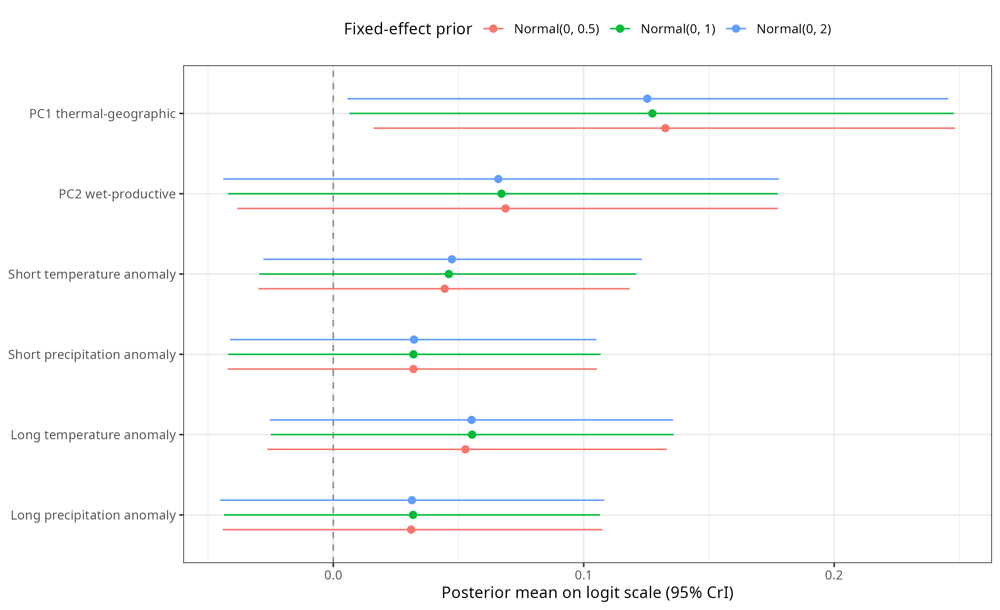

---
title: "Registered direct-predictor model"
description: "Preregistered mean-only model with direct environmental predictors, used to assess sensitivity to the PCA-based primary specification."
---

## Overview

This chapter presents the **preregistered environmental specification**, in which temperature, precipitation, DTR, NDVI, absolute latitude, and distance from the coast enter the model directly. Their coefficients are estimated jointly, but the predictors are correlated and therefore cannot be interpreted as independent or uniquely attributable environmental effects.

The PCA specification was an unregistered dimensional-reduction addition. Because strong collinearity among the direct predictors makes their mutually adjusted coefficients difficult to identify, the PCA models are reported as the primary environmental models. The registered direct-predictor model is retained here to assess whether the conclusions depend on that modelling choice. This distinction concerns registration status, not chapter order: the present model is the registered specification, while its role in the final analysis is a sensitivity analysis of the PCA-based primary result.

The model includes methodological controls (nest box and marker type), the same population, species, and phylogenetic random-effect structure as the PCA model, and a single global precision parameter (`phi ~ 1`).

```{r}
#| label: sensitivity-setup
#| echo: true

library(dplyr)
library(readr)
library(tibble)
library(knitr)

read_csv_unicode <- function(file, ...) {
  as_tibble(utils::read.csv(
    file,
    check.names = FALSE,
    stringsAsFactors = FALSE
  ))
}

model_dir <- "models/sensitivity_models"

first_existing <- function(paths) {
  existing <- paths[file.exists(paths)]
  if (length(existing) == 0) {
    return(NA_character_)
  }
  existing[1]
}

summary_files <- list(
  first_month_mu = first_existing(c(file.path(model_dir, "summary_m_sensitivity_first_month_mu.txt")))
)

fixed_effects_file <- first_existing(c(
  file.path(model_dir, "fixed_effects_sensitivity_models.csv")
))
diagnostics_file <- first_existing(c(
  file.path(model_dir, "diagnostics_sensitivity_models.csv")
))
predictor_correlations_file <- first_existing(c(
  file.path(model_dir, "direct_predictor_correlation_matrix.csv")
))
predictor_correlation_pairs_file <- first_existing(c(
  file.path(model_dir, "direct_predictor_correlation_pairs.csv")
))
posterior_correlations_file <- first_existing(c(
  file.path(model_dir, "direct_coefficient_posterior_correlation_matrix.csv")
))
posterior_correlation_pairs_file <- first_existing(c(
  file.path(model_dir, "direct_coefficient_posterior_correlation_pairs.csv")
))
pc1_correlations_file <- first_existing(c(
  file.path(model_dir, "pc1_direct_predictor_correlations.csv")
))
phi_file <- first_existing(c(
  file.path(model_dir, "direct_model_phi_summary.csv")
))

required_result_files <- c(
  fixed_effects_file,
  diagnostics_file,
  predictor_correlations_file,
  predictor_correlation_pairs_file,
  posterior_correlations_file,
  posterior_correlation_pairs_file,
  pc1_correlations_file,
  phi_file
)
if (any(is.na(required_result_files))) {
  stop("One or more registered direct-predictor result files are missing.")
}

direct_fixed_effects <- read_csv_unicode(fixed_effects_file) %>%
  filter(model == "Mean-only sensitivity")

if (nrow(direct_fixed_effects) == 0L) {
  stop("The registered direct-predictor fixed effects are missing.")
}
if (any(direct_fixed_effects$lower > 0 | direct_fixed_effects$upper < 0)) {
  stop("The written interpretation must be updated: a direct-predictor interval now excludes zero.")
}

direct_effect_row <- function(predictor_name) {
  result <- direct_fixed_effects %>%
    filter(predictor == predictor_name)
  if (nrow(result) != 1L) {
    stop("Expected exactly one direct-effect row for ", predictor_name, ".")
  }
  result
}

temperature_effect <- direct_effect_row("Mean temperature")
dtr_effect <- direct_effect_row("DTR")

pc1_correlations <- read_csv_unicode(pc1_correlations_file)
predictor_correlation_matrix <- read_csv_unicode(
  predictor_correlations_file
)
predictor_correlation_pairs <- read_csv_unicode(
  predictor_correlation_pairs_file
)
posterior_correlation_matrix <- read_csv_unicode(
  posterior_correlations_file
)
posterior_correlation_pairs <- read_csv_unicode(
  posterior_correlation_pairs_file
)

pc1_r <- function(predictor_name) {
  result <- pc1_correlations %>%
    filter(predictor == predictor_name)
  if (nrow(result) != 1L) {
    stop("Expected exactly one PC1 correlation for ", predictor_name, ".")
  }
  result$correlation_with_PC1[[1]]
}

show_saved_summary <- function(summary_file, label) {
  if (!is.na(summary_file) && file.exists(summary_file)) {
    cat("<details><summary>", label, "</summary>\n\n```\n", sep = "")
    cat(readLines(summary_file), sep = "\n")
    cat("\n```\n</details>\n")
  }
}
```

## Predictors

| Model | Mean component predictors | Precision component |
|----|----|----|
| Registered direct-predictor model | mean temperature, precipitation (log), DTR, NDVI, absolute latitude, distance to coast, `nest_box`, `marker_type` | `phi ~ 1` |

## Registered direct-predictor model

```{r}
#| label: sensitivity-first-month-mu-code
#| eval: false

m_sensitivity_first_month_mu <- brms::brm(
  n_epp_broods | trials(n_broods_sampled) ~
    tmp_cru_C_first_month_z +
    pre_cru_mm_first_month_log_z +
    dtr_cru_C_first_month_z +
    ndvi_first_month_median_30km_z +
    abs_latitude_z +
    distance_to_coast_z +
    nest_box +
    marker_type +
    (1 | population_id) +
    (1 | species_nonphylo) +
    (1 | gr(species_phylo, cov = phylo_mat_fit)),
  data = dat_fit,
  data2 = list(phylo_mat_fit = phylo_mat_fit),
  family = brms::beta_binomial(link = "logit", link_phi = "log"),
  prior = priors_mu,
  chains = 4,
  cores = 4,
  iter = 10000,
  warmup = 5000,
  control = list(adapt_delta = 0.99, max_treedepth = 15),
  seed = 1501,
  save_pars = brms::save_pars(all = TRUE)
)
```

```{r}
#| label: sensitivity-first-month-mu-summary
#| echo: true
#| results: asis

show_saved_summary(summary_files$first_month_mu, "Show summary for the registered direct-predictor model")
```

## Environmental effect plots

The panel below shows model-predicted EPP along the four direct environmental predictors from the registered model. Because the other correlated predictors are held constant, these are conditional predictions rather than isolated marginal effects. Lines show posterior mean predictions, ribbons show 95% credible intervals, and raw observations are shown only as a light background layer.

```{r}
#| label: sensitivity-environmental-effects-panel
#| echo: true
#| fig-cap: "Conditional predictions of EPP along direct environmental predictors from the registered model."
#| fig-width: 8.5
#| fig-height: 5.8

if (file.exists("figures/sensitivity_environmental_effects.png")) {
  knitr::include_graphics("figures/sensitivity_environmental_effects.png")
}
```

```{r}
#| label: sensitivity-methodological-controls-predictions
#| echo: true
#| fig-cap: "Predicted EPP for methodological moderators in the registered direct-predictor model. Points show posterior predicted means and vertical intervals show 95% credible intervals."
#| fig-width: 8
#| fig-height: 3.4

if (file.exists("figures/sensitivity_methodological_controls_predictions.png")) {
  knitr::include_graphics("figures/sensitivity_methodological_controls_predictions.png")
}
```

## Fixed effects

```{r}
#| label: sensitivity-fixed-effects-plot
#| echo: true
#| fig-cap: "Fixed-effect summary for the registered direct-predictor model. Points show posterior estimates and horizontal intervals show 95% credible intervals on the logit scale. Categorical effects are contrasts against the reference groups: nest box = no and marker type = DNA fingerprinting; Nest box compares records with nest-box use to records without nest-box use."
#| fig-width: 9
#| fig-height: 3.8

if (file.exists("figures/sensitivity_fixed_effects_forest_plot.png")) {
  knitr::include_graphics("figures/sensitivity_fixed_effects_forest_plot.png")
} else {
  cat("Sensitivity fixed-effect plot is not available yet. Render the Figures chapter to create it.")
}
```

## Interpretation relative to the PCA model

Mean temperature had a posterior coefficient of `r sprintf("%.3f", temperature_effect$estimate)` on the logit scale (95% CrI [`r sprintf("%.3f", temperature_effect$lower)`, `r sprintf("%.3f", temperature_effect$upper)`]; probability of a positive direction = `r sprintf("%.3f", temperature_effect$prob_positive)`). DTR had a coefficient of `r sprintf("%.3f", dtr_effect$estimate)` (95% CrI [`r sprintf("%.3f", dtr_effect$lower)`, `r sprintf("%.3f", dtr_effect$upper)`]; probability of a positive direction = `r sprintf("%.3f", dtr_effect$prob_positive)`). Both coefficients point in the same direction as the positive PC1 association, because higher PC1 denotes warmer sites with greater DTR, but both 95% credible intervals include zero. None of the other directly estimated environmental, geographic, or methodological coefficients had a 95% credible interval excluding zero.

On the same model frame, PC1 correlated `r sprintf("%.3f", pc1_r("Temperature"))` with temperature, `r sprintf("%.3f", pc1_r("DTR"))` with DTR, and `r sprintf("%.3f", pc1_r("Absolute latitude"))` with absolute latitude. The PCA coefficient therefore captures their shared thermal-geographic variation. The registered direct-predictor model does not identify whether the main PC1 association is attributable to temperature, DTR, latitude, or another constituent: separating those contributions is limited by the correlation structure rather than contradicted by the direction of the direct estimates.

```{r}
#| label: registered-model-pc1-correlations
#| echo: true

pc1_correlations %>%
  transmute(
    Predictor = predictor,
    `Correlation with PC1` = round(correlation_with_PC1, 3)
  ) %>%
  kable()
```

## Collinearity diagnostics

### Correlations among observed predictors

The strongest pairwise correlation among the six direct predictors was between `r predictor_correlation_pairs$predictor_1[[1]]` and `r predictor_correlation_pairs$predictor_2[[1]]` ($r$ = `r sprintf("%.3f", predictor_correlation_pairs$correlation[[1]])`). Temperature and DTR were positively correlated ($r$ = `r sprintf("%.3f", predictor_correlation_pairs$correlation[predictor_correlation_pairs$predictor_1 == "DTR" & predictor_correlation_pairs$predictor_2 == "Temperature"])`), while both were negatively related to absolute latitude. These correlations mean that each direct coefficient is conditional on several predictors carrying overlapping environmental information.

```{r}
#| label: registered-model-predictor-correlation-matrix
#| echo: true

predictor_correlation_matrix %>%
  mutate(across(-Predictor, ~ round(.x, 3))) %>%
  kable()
```

### Posterior correlations among environmental coefficients

Posterior correlations show the trade-offs among jointly estimated coefficients after the likelihood, priors, and hierarchical structure have all been taken into account. They are therefore a direct Bayesian diagnostic of the same identifiability problem that a VIF is intended to flag. The strongest posterior correlation was `r sprintf("%.3f", posterior_correlation_pairs$correlation[[1]])` between the `r posterior_correlation_pairs$predictor_1[[1]]` and `r posterior_correlation_pairs$predictor_2[[1]]` coefficients. The next strongest was `r sprintf("%.3f", posterior_correlation_pairs$correlation[[2]])` between `r posterior_correlation_pairs$predictor_1[[2]]` and `r posterior_correlation_pairs$predictor_2[[2]]`. Thus, posterior uncertainty is not separable across the direct environmental effects, even though the sampler itself converged well.

```{r}
#| label: registered-model-posterior-correlation-matrix
#| echo: true

posterior_correlation_matrix %>%
  mutate(across(-Predictor, ~ round(.x, 3))) %>%
  kable()
```

## MCMC diagnostics and residual dispersion

```{r}
#| label: registered-model-diagnostics
#| echo: true

registered_diagnostics <- read_csv_unicode(diagnostics_file) %>%
  filter(model == "m_sensitivity_first_month_mu") %>%
  transmute(
    Model = "Registered direct predictors",
    `Maximum R-hat` = sprintf("%.3f", max_rhat),
    `Minimum bulk ESS` = round(min_bulk_ess),
    `Minimum tail ESS` = round(min_tail_ess),
    Divergences = divergent_transitions,
    `Maximum-treedepth hits` = treedepth_hits
  )

if (nrow(registered_diagnostics) != 1L) {
  stop("Diagnostics for the registered direct-predictor model are missing.")
}

kable(registered_diagnostics)
```

The model had a maximum $\hat{R}$ of `r registered_diagnostics[["Maximum R-hat"]][[1]]`, minimum bulk and tail ESS of `r registered_diagnostics[["Minimum bulk ESS"]][[1]]` and `r registered_diagnostics[["Minimum tail ESS"]][[1]]`, no divergent transitions, and no maximum-treedepth hits. The posterior correlations above therefore reflect the model's correlated coefficient geometry rather than failed MCMC convergence.

```{r}
#| label: registered-model-phi
#| echo: true

registered_phi <- read_csv_unicode(phi_file)
if (nrow(registered_phi) != 1L) {
  stop("The registered-model phi summary must contain exactly one row.")
}

registered_phi %>%
  transmute(
    `phi posterior mean [95% CrI]` = sprintf(
      "%.2f [%.2f, %.2f]",
      phi_posterior_mean, phi_lower_95, phi_upper_95
    ),
    `Residual rho [95% CrI]` = sprintf(
      "%.3f [%.3f, %.3f]",
      residual_rho_posterior_mean,
      residual_rho_lower_95,
      residual_rho_upper_95
    )
  ) %>%
  kable()
```

The beta-binomial precision estimate was `r sprintf("%.2f", registered_phi$phi_posterior_mean)` (95% CrI [`r sprintf("%.2f", registered_phi$phi_lower_95)`, `r sprintf("%.2f", registered_phi$phi_upper_95)`]), corresponding to residual $\rho \approx$ `r sprintf("%.3f", registered_phi$residual_rho_posterior_mean)`. Extra-binomial variation therefore remained after accounting for the registered predictors and hierarchical random effects.

## Prior sensitivity of the primary models

To assess whether the primary environmental results were driven by the weakly informative fixed-effect prior, we refitted the PCA, short-anomaly, and long-anomaly mean models after replacing the common prior on non-intercept coefficients, $\operatorname{Normal}(0,1)$, with either $\operatorname{Normal}(0,0.5)$ or $\operatorname{Normal}(0,2)$. Each refit used the same 441-record model frame, formula, beta-binomial family, random effects, intercept prior $\operatorname{Normal}(0,2)$, exponential(1) priors on group-level SDs and $\phi$, and sampler settings as its primary counterpart. Only the prior SD for class `b` changed; the sensitivity fits used new seeds.

```{r}
#| label: primary-model-prior-sensitivity-setup
#| echo: true

prior_sensitivity_dir <- "models/prior_sensitivity_models"
prior_focal_file <- file.path(
  prior_sensitivity_dir, "focal_coefficients_prior_sensitivity.csv"
)
prior_stability_file <- file.path(
  prior_sensitivity_dir, "prior_sensitivity_stability_summary.csv"
)
prior_diagnostics_file <- file.path(
  prior_sensitivity_dir, "diagnostics_prior_sensitivity.csv"
)

if (!all(file.exists(c(
  prior_focal_file, prior_stability_file, prior_diagnostics_file
)))) {
  stop("Prior-sensitivity result files are missing.")
}

prior_focal <- read_csv_unicode(prior_focal_file)
prior_stability <- read_csv_unicode(prior_stability_file)
prior_diagnostics <- read_csv_unicode(prior_diagnostics_file)

focal_stability <- prior_stability %>%
  filter(scope == "focal environmental coefficients") %>%
  arrange(prior_sd)
all_fixed_stability <- prior_stability %>%
  filter(scope == "all non-intercept fixed effects") %>%
  arrange(prior_sd)

if (nrow(focal_stability) != 2L || nrow(all_fixed_stability) != 2L) {
  stop("Prior-sensitivity stability summaries are incomplete.")
}
if (any(prior_stability$n_interval_conclusions_changed != 0L)) {
  stop("A prior-sensitivity interval conclusion changed; update the written interpretation.")
}
```

```{r}
#| label: primary-model-prior-sensitivity-table
#| echo: true

prior_focal %>%
  mutate(
    Model = recode(model,
      pca = "PCA", short = "Short anomaly", long = "Long anomaly"
    ),
    Prior = case_when(
      prior_sd == 0.5 ~ "Normal(0, 0.5)",
      prior_sd == 1 ~ "Normal(0, 1) - primary",
      prior_sd == 2 ~ "Normal(0, 2)"
    ),
    `Posterior mean [95% CrI]` = sprintf(
      "%.3f [%.3f, %.3f]", estimate, lower, upper
    ),
    `Probability of direction` = sprintf("%.3f", probability_of_direction)
  ) %>%
  select(Model, Predictor = predictor, Prior,
         `Posterior mean [95% CrI]`, `Probability of direction`) %>%
  kable()
```

Across the six focal environmental coefficients, changing the prior to $\operatorname{Normal}(0,0.5)$ shifted posterior means by at most `r sprintf("%.3f", focal_stability$max_absolute_estimate_shift[focal_stability$prior_sd == 0.5])`, while $\operatorname{Normal}(0,2)$ shifted them by at most `r sprintf("%.3f", focal_stability$max_absolute_estimate_shift[focal_stability$prior_sd == 2])` on the logit scale. No focal coefficient, and no other non-intercept fixed effect, changed whether its 95% credible interval included zero. Thus, within this fourfold range of prior variance, the substantive conclusions were insensitive to the fixed-effect prior and were supported by the likelihood rather than created by the baseline prior.

```{r}
#| label: primary-model-prior-sensitivity-figure
#| echo: true
#| fig-cap: "Prior sensitivity of the focal environmental coefficients in the three primary mean models. Points are posterior means and horizontal intervals are 95% credible intervals on the logit scale."
#| fig-width: 9.5
#| fig-height: 5.8

if (file.exists("figures/prior_sensitivity_focal_coefficients.png")) {
  
}
```

```{r}
#| label: primary-model-prior-sensitivity-diagnostics
#| echo: true

prior_diagnostics %>%
  mutate(
    Model = recode(model,
      pca = "PCA", short = "Short anomaly", long = "Long anomaly"
    ),
    Prior = if_else(prior_sd == 0.5, "Normal(0, 0.5)", "Normal(0, 2)"),
    `Maximum R-hat` = sprintf("%.3f", max_rhat),
    `Minimum bulk ESS` = round(min_bulk_ess),
    `Minimum tail ESS` = round(min_tail_ess),
    Divergences = divergent_transitions,
    `Maximum-treedepth hits` = treedepth_hits
  ) %>%
  select(Model, Prior, `Maximum R-hat`, `Minimum bulk ESS`,
         `Minimum tail ESS`, Divergences, `Maximum-treedepth hits`) %>%
  kable()
```


