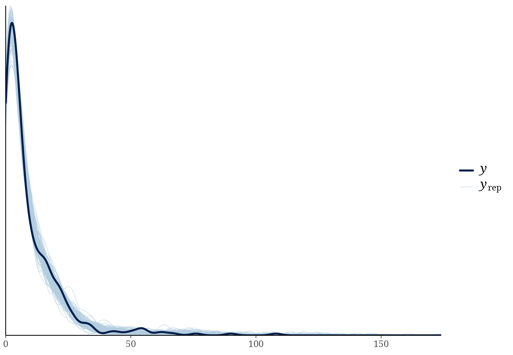

```{r}
#| label: h1-validation-setup
#| include: false
library(knitr)
model_dir <- "models/withinseason_models_corrected"
validation <- utils::read.csv(file.path(model_dir, "cru_fullseason_validation_summary.csv"), check.names = FALSE)
gate <- utils::read.csv(file.path(model_dir, "cru_fullseason_validation_gate.csv"), check.names = FALSE)
discrepancies <- utils::read.csv(file.path(model_dir, "cru_fullseason_validation_discrepancies.csv"), check.names = FALSE)
derivation_exists <- file.exists(file.path(model_dir, "withinseason_climate_by_record.csv"))
derivation_summary <- utils::read.csv(file.path(model_dir, "withinseason_derivation_summary.csv"), check.names = FALSE)
derived_climate <- utils::read.csv(file.path(model_dir, "withinseason_climate_by_record.csv"), check.names = FALSE)
cross_year_summary <- utils::read.csv(file.path(model_dir, "cross_year_season_correction_summary.csv"), check.names = FALSE)
dat_main <- readRDS("models/main_environmental_models/dat_main_environmental_models.rds")
dat_h1 <- merge(
  dat_main,
  derived_climate[, c(
    "epp_row_id", "tmp_withinseason_sd", "pre_withinseason_sd",
    "recomputed_tmp_cru_C_full_season", "recomputed_pre_cru_mm_full_season",
    "crosses_year_boundary"
  )],
  by = "epp_row_id",
  all.x = TRUE
)
h1_required <- c(
  "n_epp_broods", "n_broods_sampled", "tmp_withinseason_sd",
  "pre_withinseason_sd", "recomputed_tmp_cru_C_full_season",
  "recomputed_pre_cru_mm_full_season", "nest_box", "marker_type",
  "population_id", "species_nonphylo", "species_phylo"
)
dat_h1 <- dat_h1[stats::complete.cases(dat_h1[, h1_required]), , drop = FALSE]
h1_counts <- data.frame(
  records = nrow(dat_h1),
  populations = length(unique(dat_h1$population_id)),
  species = length(unique(dat_h1$species_nonphylo)),
  reduction_from_main_records = nrow(dat_main) - nrow(dat_h1)
)
result_files <- file.path(
  model_dir,
  c(
    "fixed_effects_withinseason_h1.csv",
    "diagnostics_withinseason_h1.csv",
    "phi_withinseason_h1.csv",
    "withinseason_h1_model_frame_counts.csv"
  )
)
if (!all(file.exists(result_files))) stop("The fitted H1 result files are incomplete.")
h1_effects <- utils::read.csv(result_files[1], check.names = FALSE)
h1_diagnostics <- utils::read.csv(result_files[2], check.names = FALSE)
h1_phi <- utils::read.csv(result_files[3], check.names = FALSE)
h1_fit_counts <- utils::read.csv(result_files[4], check.names = FALSE)
```

## Outcome: provenance resolved and validation passed

The provenance problem that initially blocked this preregistered H1 analysis has been resolved. The stored main climate variables came from **CRU TS v4.09**, not v4.10. After using that exact product and the empirically recovered locality-to-grid-cell map, both prespecified validation gates passed, the two within-season standard deviations were derived with the corrected cross-year convention, and the preregistered additive H1 model was fitted.

The complete-case H1 model frame contains exactly 422 records from 162 populations and 106 species: 15 of the 441 main-model records lack a breeding-season end month and four complete windows contain exactly one month, for which a within-season SD is undefined. Those 19 records are removed without imputation. Because this model uses different observations from the 441-record main models, it is reported separately and is not compared with them by LOO.

```{r}
#| label: h1-model-frame-counts
kable(h1_counts, row.names = FALSE, caption = "Verified complete-case H1 model frame.")
```

## Empirical reconstruction check

CRU TS v4.09 monthly temperature and precipitation were re-extracted for every complete-window, non-cross-year model-frame record dated 1982--1990. The validation scope excludes cross-year windows because the stored fields encode the historical same-year convention that is being corrected here. The extraction used the same 0.5-degree cells that reproduce the stored main climate series; this map is retained in `models/climate_provenance/cru_ts_4.09_reconstructed_grid_mapping.csv`. Full-season temperature was recomputed as the mean across breeding months and full-season precipitation as the sum. Absolute differences, rather than correlations, were used.

```{r}
#| label: h1-validation-summary
validation_display <- validation
validation_display$max_absolute_difference <- format(
  validation_display$max_absolute_difference,
  scientific = TRUE,
  digits = 3
)
validation_display$mean_absolute_difference <- format(
  validation_display$mean_absolute_difference,
  scientific = TRUE,
  digits = 3
)
kable(
  validation_display,
  row.names = FALSE,
  caption = "CRU full-season reconstruction against stored values."
)
```

The hard-stop thresholds were 0.01°C for temperature and 0.1 mm for precipitation. Both variables passed for all 22 comparison records: the maximum absolute differences were approximately $4.0\times10^{-9}$°C and $4.8\times10^{-8}$ mm, respectively, and no record differed by more than 0.001. Therefore `withinseason_climate_by_record.csv` was created (`r derivation_exists`).

## Derived within-season variables

```{r}
#| label: h1-derivation-summary
kable(
  derivation_summary,
  row.names = FALSE,
  caption = "Availability of within-season climate standard deviations."
)
```

For each population-year with at least two breeding months, `tmp_withinseason_sd` is the sample SD of monthly mean temperature and `pre_withinseason_sd` is the sample SD of monthly precipitation totals across the same named months. Four one-month seasons receive `NA` because an SD is undefined; 15 incomplete windows also remain `NA`. No climate values are imputed. These variables differ from `br_tmp_withinyear_var`, which is calculated across all 12 calendar months in the fixed 1961--1990 reference period.

For the 63 complete breeding windows that cross December--January, months from
the reported start through December use the record's `climate_year`, whereas
January-side months use `climate_year + 1`. This is the biologically coherent
calendar convention. The old same-year derivation and its fitted model remain
unchanged in `models/withinseason_models/` as a provenance audit, but are not
used as the final H1 result. The corrected derivation changes full-season mean
temperature by 0.258 degrees C on average (maximum 0.980 degrees C) and
full-season precipitation by 87.7 mm on average (maximum 294.5 mm) across the
63 affected records.

```{r}
#| label: h1-cross-year-correction
kable(cross_year_summary, digits = 3, row.names = FALSE,
      caption = "Effect of assigning January-side breeding months to the following calendar year.")
```

## Registered model

The verified variables enter the preregistered additive model as follows:

```{r}
#| eval: false
n_epp_broods | trials(n_broods_sampled) ~
  tmp_withinseason_sd_z + pre_withinseason_sd_z +
  recomputed_tmp_cru_C_full_season_z + recomputed_pre_cru_mm_full_season_z +
  nest_box + marker_type +
  (1 | population_id) + (1 | species_nonphylo) +
  (1 | gr(species_phylo, cov = phylo_mat_fit))
```

All four continuous climate predictors were standardized only after complete-case filtering on the final 422-record H1 model frame. All coefficients were retained and are reported below; no backward elimination was used.

The model used the same weakly informative priors as the main analyses:
`normal(0, 2)` for the intercept, `normal(0, 1)` for fixed-effect
coefficients, and `exponential(1)` for random-effect standard deviations and
the beta-binomial precision parameter $\phi$. Their literal equality to the
`priors_mu` object in the main fitting script was verified automatically before
sampling. Four chains were run for 10,000 iterations each (5,000 warmup), with
`adapt_delta = 0.99`, `max_treedepth = 15`, and new seed 1901.

## Model-frame size

```{r}
#| label: h1-fitted-frame-counts
kable(h1_fit_counts, row.names = FALSE, caption = "Sample size used by the fitted H1 model.")
```

## Posterior estimates

Posterior means, 95% credible intervals (CrI), and probability of direction
(pd) are reported for every coefficient. Here pd is the larger of the posterior
probabilities that the coefficient is above or below zero; it is descriptive,
and no significance threshold is applied.

```{r}
#| label: h1-fixed-effects
effect_labels <- c(
  b_Intercept = "Intercept",
  b_tmp_withinseason_sd_z = "Within-season temperature SD",
  b_pre_withinseason_sd_z = "Within-season precipitation SD",
  b_recomputed_tmp_cru_C_full_season_z = "Corrected full-season mean temperature",
  b_recomputed_pre_cru_mm_full_season_z = "Corrected full-season total precipitation",
  b_nest_boxyes = "Nest box: yes",
  b_marker_typemicrosatellite = "Marker: microsatellite",
  b_marker_typeSNP = "Marker: SNP",
  b_marker_typeSNPs = "Marker: SNPs",
  b_marker_typeother = "Marker: other"
)
h1_display <- h1_effects
h1_display$predictor <- unname(effect_labels[h1_display$term])
h1_display$predictor[is.na(h1_display$predictor)] <- h1_display$term[is.na(h1_display$predictor)]
h1_display <- h1_display[, c("predictor", "estimate", "lower", "upper", "probability_of_direction")]
kable(h1_display, digits = 3, row.names = FALSE,
      caption = "All fixed-effect coefficients from the preregistered within-season H1 model.")
```

```{r}
#| label: h1-key-effect-objects
#| include: false
get_effect <- function(term) h1_effects[h1_effects$term == term, , drop = FALSE]
tmp_sd_effect <- get_effect("b_tmp_withinseason_sd_z")
pre_sd_effect <- get_effect("b_pre_withinseason_sd_z")
tmp_mean_effect <- get_effect("b_recomputed_tmp_cru_C_full_season_z")
pre_mean_effect <- get_effect("b_recomputed_pre_cru_mm_full_season_z")
```

The within-season temperature-variability coefficient was
`r sprintf("%.3f", tmp_sd_effect$estimate)` (95% CrI
`r sprintf("%.3f", tmp_sd_effect$lower)` to
`r sprintf("%.3f", tmp_sd_effect$upper)`), and the within-season
precipitation-variability coefficient was
`r sprintf("%.3f", pre_sd_effect$estimate)` (95% CrI
`r sprintf("%.3f", pre_sd_effect$lower)` to
`r sprintf("%.3f", pre_sd_effect$upper)`). The corresponding full-season mean
coefficients were `r sprintf("%.3f", tmp_mean_effect$estimate)` for temperature
and `r sprintf("%.3f", pre_mean_effect$estimate)` for precipitation. These four
estimates jointly test the registered H1; their credible intervals, rather than
a dichotomous significance rule, determine the strength and precision of the
evidence.

All four climate coefficients had 95% CrIs that included zero. The corrected
estimates were -0.081 (95% CrI -0.215 to 0.051) for within-season temperature
SD, -0.040 (-0.174 to 0.095) for within-season precipitation SD, 0.179 (-0.028
to 0.383) for mean seasonal temperature, and 0.008 (-0.185 to 0.202) for total
seasonal precipitation. Mean seasonal temperature had the clearest directional
posterior (pd = 0.955), but its interval still included zero. Thus, this
registered model provides no precise evidence that either the mean or
within-season variability of breeding-season temperature or precipitation
predicts EPP.

## Beta-binomial precision and sampler diagnostics

```{r}
#| label: h1-phi
kable(h1_phi, digits = 3, row.names = FALSE,
      caption = "Posterior beta-binomial precision parameter (phi).")
```

```{r}
#| label: h1-diagnostics
kable(h1_diagnostics, digits = 2, row.names = FALSE,
      caption = "MCMC diagnostics for the within-season H1 model.")
```

The maximum R-hat was 1.002, minimum bulk ESS was 1,161, minimum tail ESS was
1,983, and there were no divergent transitions or maximum-treedepth hits.

```{r}
#| label: h1-ppc
#| fig-cap: "Posterior predictive density check for the preregistered within-season H1 model."

```
