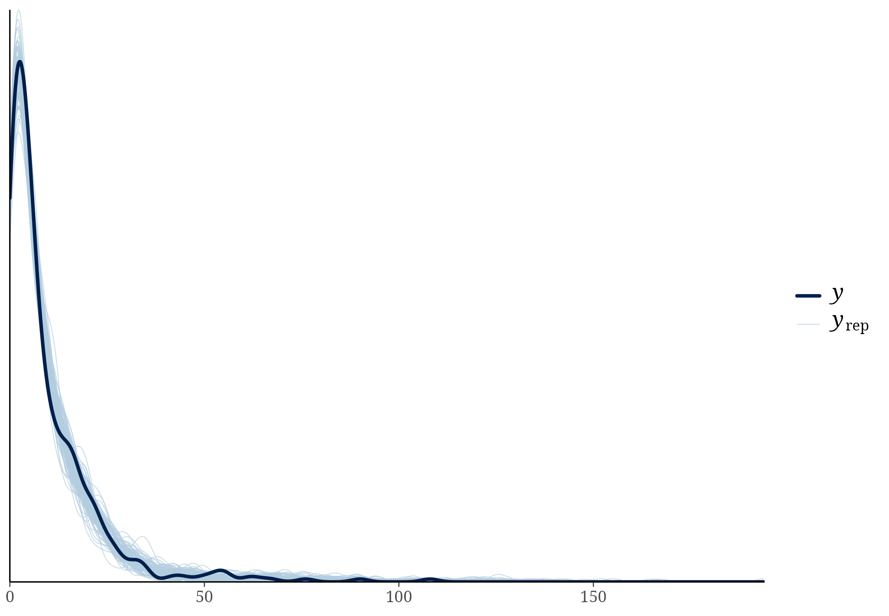
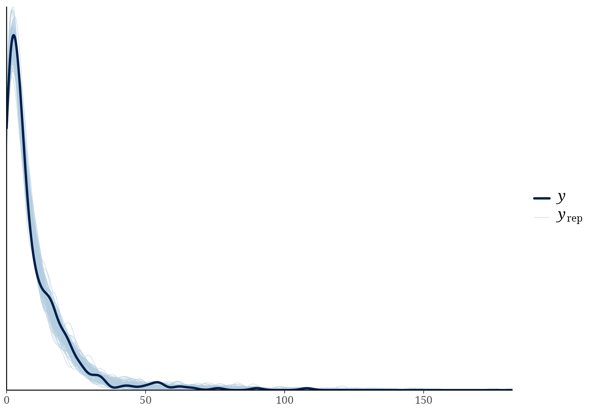

```{r}
#| label: absolute-anomaly-setup
#| include: false
library(dplyr)
library(knitr)
model_dir <- "models/absolute_anomaly_models"
read_result <- function(name) utils::read.csv(file.path(model_dir, name), check.names = FALSE)
transformation <- read_result("absolute_anomaly_transformation_audit.csv")
frame_counts <- read_result("absolute_anomaly_model_frame_counts.csv")
effects <- read_result("fixed_effects_absolute_anomaly_models.csv")
diagnostics <- read_result("diagnostics_absolute_anomaly_models.csv")
phi <- read_result("phi_absolute_anomaly_models.csv")
loo_diagnostics <- read_result("loo_diagnostics_absolute_anomaly_models.csv")
pareto_audit_summary <- utils::read.csv(
  "models/pareto_k_audit/pareto_k_model_summary.csv", check.names = FALSE
) |>
  filter(analysis == "absolute_anomaly")
pareto_audit_cases <- utils::read.csv(
  "models/pareto_k_audit/pareto_k_unique_high_observations.csv", check.names = FALSE
) |>
  filter(analysis == "absolute_anomaly") |>
  arrange(desc(max_pareto_k))
```

## Why this sensitivity analysis is needed

The current primary anomaly models use signed differences: study-year climate
minus the local short- or long-term baseline. An earlier project draft instead
used absolute deviations. These are different hypotheses. A signed coefficient
contrasts warmer with cooler conditions, or wetter with drier conditions,
whereas an absolute-deviation coefficient asks whether EPP changes as climate
moves farther from its baseline in either direction. This additive sensitivity
analysis fits the earlier interpretation explicitly without changing or
overwriting the signed-anomaly models.

For each of the four first-breeding-month anomaly variables, the absolute value
was taken on its raw scale and the resulting magnitude was then standardized
within the unchanged 441-record main-model frame. No records were added,
dropped, or imputed.

```{r}
#| label: absolute-anomaly-frame
kable(frame_counts, row.names = FALSE,
      caption = "Model frame for the absolute-anomaly sensitivity analysis.")
```

```{r}
#| label: absolute-anomaly-transformation
kable(transformation, digits = 3, row.names = FALSE,
      caption = "Executable audit of the absolute-value transformations and scaling.")
```

## Model specification

Two beta-binomial phylogenetic models were fitted. The short model contains the
absolute magnitudes of the five-year temperature and precipitation anomalies;
the long model contains the absolute magnitudes of the 1961--1989 anomalies.
Both retain absolute latitude, distance to coast, nest-box use, marker type,
and the same population, species, and phylogenetic random intercepts as the
matching signed models:

```{r}
#| eval: false
n_epp_broods | trials(n_broods_sampled) ~
  absolute_temperature_anomaly_z + absolute_precipitation_anomaly_z +
  abs_latitude_z + distance_to_coast_z + nest_box + marker_type +
  (1 | population_id) + (1 | species_nonphylo) +
  (1 | gr(species_phylo, cov = phylo_mat_fit))
```

The literal `priors_mu` block was verified against the main fitting script:
Normal(0, 2) for the intercept, Normal(0, 1) for fixed effects, and
Exponential(1) for random-effect standard deviations and beta-binomial
precision. Each model used four chains, 10,000 iterations (5,000 warmup),
`adapt_delta = 0.99`, `max_treedepth = 15`, and new seeds 2001 and 2002. All
coefficients are retained; no backward elimination was performed.

## Posterior estimates

Posterior means, 95% credible intervals, and probability of direction are
reported for every population-level coefficient. Probability of direction is
the larger posterior probability that a coefficient lies above or below zero;
no significance threshold is applied.

```{r}
#| label: absolute-anomaly-effects
effect_labels <- c(
  b_Intercept = "Intercept",
  b_tmp_short_anom_5yr_C_first_month_abs_z = "Absolute short temperature anomaly",
  b_pre_short_anom_5yr_mm_first_month_abs_z = "Absolute short precipitation anomaly",
  b_tmp_long_anom_1961_1989_C_first_month_abs_z = "Absolute long temperature anomaly",
  b_pre_long_anom_1961_1989_mm_first_month_abs_z = "Absolute long precipitation anomaly",
  b_abs_latitude_z = "Absolute latitude",
  b_distance_to_coast_z = "Distance to coast",
  b_nest_boxyes = "Nest box: yes",
  b_marker_typemicrosatellite = "Marker: microsatellite",
  b_marker_typeSNP = "Marker: SNP",
  b_marker_typeSNPs = "Marker: SNPs",
  b_marker_typeother = "Marker: other"
)
effects_display <- effects |>
  mutate(predictor = unname(effect_labels[term]),
         predictor = ifelse(is.na(predictor), term, predictor)) |>
  select(model, predictor, estimate, lower, upper, probability_of_direction)
kable(effects_display, digits = 3, row.names = FALSE,
      caption = "All fixed effects from the absolute-anomaly sensitivity models.")
```

```{r}
#| label: absolute-anomaly-key-effects
#| include: false
key_effects <- effects |>
  filter(grepl("_abs_z$", term))
```

```{r}
#| label: absolute-anomaly-key-table
kable(key_effects, digits = 3, row.names = FALSE,
      caption = "Absolute temperature- and precipitation-anomaly coefficients.")
```

The four magnitude coefficients above test whether increasingly unusual
first-month climate, irrespective of direction, is associated with EPP. Their
posterior intervals all included zero. The short-term magnitude coefficients
were 0.024 (95% CrI -0.060 to 0.106; pd = 0.713) for temperature and -0.006
(-0.102 to 0.088; pd = 0.553) for precipitation. The long-term coefficients
were 0.051 (-0.028 to 0.132; pd = 0.898) for temperature and 0.011 (-0.084 to
0.106; pd = 0.587) for precipitation. Thus there is no precise evidence that
EPP changes with the magnitude of either climatic departure. These models do
not change the definition or interpretation of the primary signed-anomaly
coefficients.

## Precision, diagnostics, and LOO caution

```{r}
#| label: absolute-anomaly-phi
kable(phi, digits = 3, row.names = FALSE,
      caption = "Beta-binomial precision parameters.")
```

```{r}
#| label: absolute-anomaly-diagnostics
kable(diagnostics, digits = 2, row.names = FALSE,
      caption = "Sampler diagnostics.")
kable(loo_diagnostics, digits = 3, row.names = FALSE,
      caption = "Pareto-k diagnostics for approximate LOO.")
```

Both models mixed well (maximum R-hat below 1.002, minimum bulk ESS above
2,280, minimum tail ESS above 2,000, no divergences, and no maximum-treedepth
hits). The approximate LOO diagnostics were much less satisfactory: 27
observations exceeded Pareto $k=0.7$ in the short model and 29 in the long
model; two long-model observations exceeded 1. These were inspected rather
than treated as a model-ranking result. None came from the five most intensively
sampled populations and their median population record count was one. The two
cases above 1 were *Malurus lamberti* and *Ardea ibis*; the latter is tropical,
whereas the former has an unusually large brood sample within a singleton
population.

```{r}
#| label: absolute-anomaly-pareto-audit
kable(
  pareto_audit_summary |>
    select(model, max_pareto_k, n_pareto_k_gt_0_7, n_pareto_k_gt_1,
           n_high_tropical, proportion_high_tropical,
           n_high_top5_population, median_population_records_high),
  digits = 3, row.names = FALSE,
  caption = "Inspected Pareto-k observations in the absolute-anomaly models."
)
kable(
  pareto_audit_cases |>
    slice_head(n = 12) |>
    select(species, family, order, abs_latitude, tropical,
           population_record_count, n_broods_sampled, observed_epp_rate,
           models_high, max_pareto_k),
  digits = 3, row.names = FALSE,
  caption = "Twelve largest pointwise Pareto-k values across the two absolute-anomaly models."
)
```

LOO values are therefore retained as diagnostics only. No formal predictive
comparison with the signed models is reported. If such a comparison is placed
in the submitted manuscript, exact `reloo` will first be run for the flagged
observations.

```{r}
#| label: absolute-anomaly-ppc-short
#| fig-cap: "Posterior predictive check for the short absolute-anomaly model."

```

```{r}
#| label: absolute-anomaly-ppc-long
#| fig-cap: "Posterior predictive check for the long absolute-anomaly model."

```
